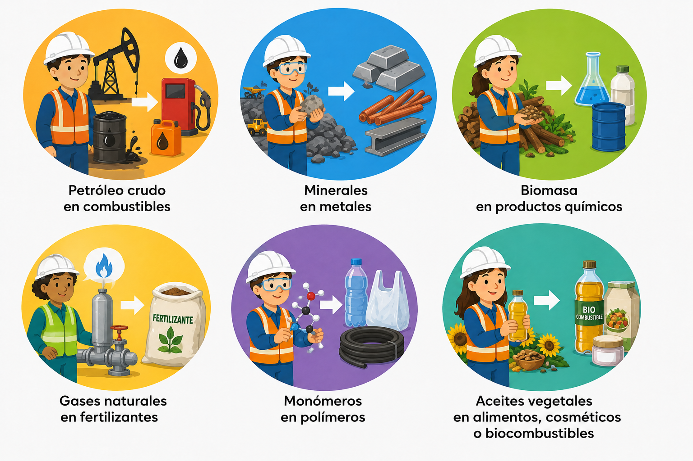
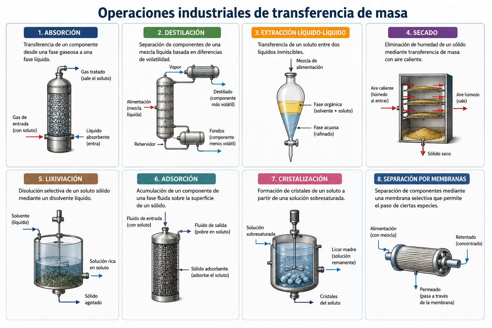
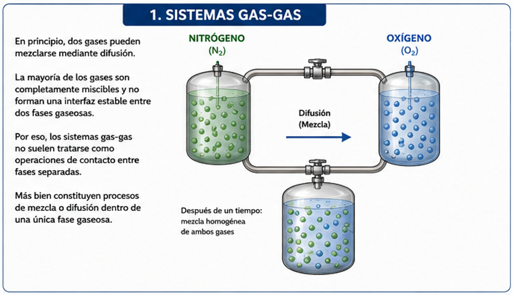
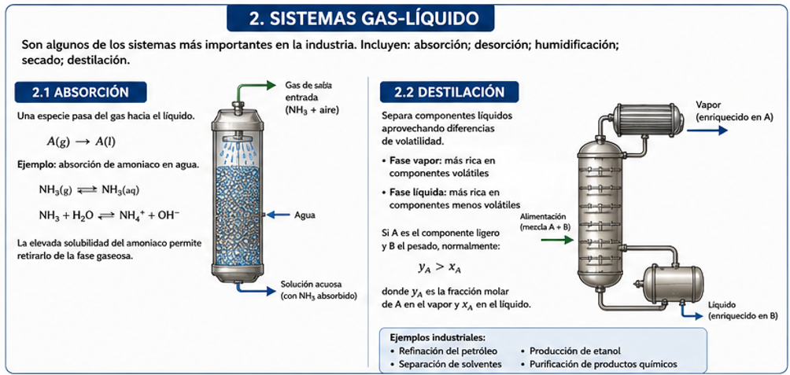
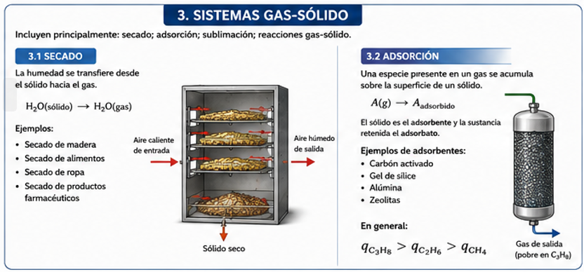
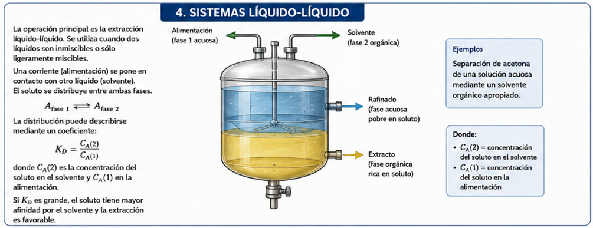
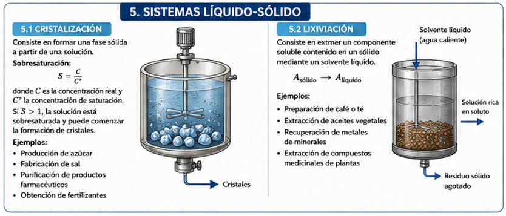
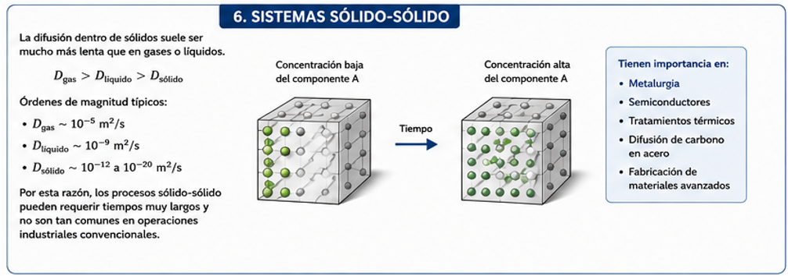

# Introducción y panorama general de las operaciones de transferencia de masa

# La transferencia de masa en la ingeniería química

La ingeniería química estudia la transformación de materias primas en productos útiles mediante procesos físicos, químicos y biológicos. Aunque esta disciplina incluye una gran variedad de actividades, buena parte de sus aplicaciones puede agruparse en tres grandes áreas:

1. Producción y síntesis de materiales.
2. Tratamiento y remediación ambiental.
3. Generación y aprovechamiento de energía.

En las tres áreas aparecen de manera constante los procesos de separación y, por lo tanto, los fenómenos de transferencia de masa.

La **transferencia de masa** estudia el movimiento de una especie química desde una región hacia otra debido, principalmente, a diferencias de composición, concentración, presión parcial, actividad o potencial químico.

Este movimiento puede ocurrir:

* dentro de una sola fase;
* entre dos fases distintas;
* por difusión molecular;
* por el movimiento global de un fluido;
* o mediante una combinación de ambos mecanismos.

---

# Áreas centrales de la ingeniería química

## Producción y síntesis de materiales

Una de las funciones principales de la ingeniería química es transformar materias primas en productos de mayor utilidad y valor económico.

Por ejemplo:

Una materia prima rara vez puede utilizarse directamente. Normalmente contiene impurezas o se encuentra mezclada con otras sustancias.

Por esta razón, antes o después de una reacción química suele ser necesario realizar una separación.

Un proceso industrial típico puede representarse como:

$$
\text{Materia prima}
\longrightarrow
\text{Purificación}
\longrightarrow
\text{Reacción}
\longrightarrow
\text{Separación}
\longrightarrow
\text{Producto}
$$

Por ejemplo, para producir amoniaco mediante el proceso Haber-Bosch es necesario purificar previamente el nitrógeno y el hidrógeno. Después de la reacción, también deben separarse el amoniaco producido y los gases que no reaccionaron.

---

## Remediación del aire, el agua y el suelo

El crecimiento industrial y las actividades humanas generan contaminantes que pueden acumularse en tres medios principales:

* aire;
* agua;
* suelo.

La ingeniería química participa en el desarrollo de procesos para eliminar, recuperar o transformar estos contaminantes.

Algunos ejemplos son:

En todos estos casos, una o varias especies químicas deben desplazarse desde el medio contaminado hacia otra fase donde puedan ser capturadas, destruidas o recuperadas.

Por ejemplo, en la absorción de un contaminante gaseoso:

$$
A_{(g)}
\longrightarrow
A_{(l)}
$$

La sustancia $A$ se transfiere desde la fase gaseosa hacia una fase líquida.

---

## Generación y aprovechamiento de energía

Todos los procesos industriales requieren energía para funcionar.

La energía se utiliza para:

Además, la ingeniería química participa directamente en procesos de generación de energía, como:

* combustión;
* producción de hidrógeno;
* refinación de petróleo;
* procesamiento de gas natural;
* fabricación de biocombustibles;
* conversión electroquímica;
* energía nuclear.

Muchos de estos procesos incluyen simultáneamente transferencia de calor y transferencia de masa.

Por ejemplo, durante la combustión de una gota de combustible:

1. El calor llega a la gota.
2. El combustible líquido se evapora.
3. El vapor se difunde hacia el aire.
4. El oxígeno se difunde hacia la zona de reacción.
5. Se produce la reacción química.

---

# Importancia de las separaciones

La separación de mezclas se practica desde hace miles de años.

Algunos ejemplos históricos son:

* extracción de metales a partir de minerales;
* obtención de perfumes de flores;
* extracción de colorantes de plantas;
* evaporación de agua de mar para producir sal;
* destilación de bebidas alcohólicas;
* filtración de agua.

Aunque el reactor suele considerarse el elemento central de una planta química, los equipos de separación pueden representar una parte muy importante del costo total del proceso.

En muchas industrias, la separación consume más energía y dinero que la propia reacción química.

---

# Relación entre concentración y costo de separación

El costo de obtener una sustancia pura depende en gran medida de su concentración inicial.

Puede definirse un factor aproximado de enriquecimiento como:

$$
F_E=\frac{C_f}{C_i}
$$

donde:

* $C_i$ es la concentración inicial;
* $C_f$ es la concentración final deseada.

Cuanto mayor sea el valor de $F_E$, más exigente suele ser el proceso de separación.

## Ejemplo 1: sustancia relativamente concentrada

Supongamos una materia prima que contiene 50 % de una sustancia y se desea obtenerla al 95 %.

$$
F_E=\frac{0.95}{0.50}=1.9
$$

El enriquecimiento requerido es relativamente pequeño.

## Ejemplo 2: sustancia muy diluida

Ahora supongamos una materia prima que contiene 0.1 % de una sustancia y se desea obtenerla al 95 %.

$$
F_E=\frac{0.95}{0.001}=950
$$

En este caso, el proceso debe aumentar la concentración aproximadamente 950 veces.

Esto implica, por lo general:

* mayor consumo de energía;
* más etapas de separación;
* equipos más grandes;
* mayor tiempo de operación;
* mayores costos.

Esta es una de las razones por las cuales la recuperación de elementos presentes en concentraciones muy bajas puede ser extremadamente costosa.

---

# Perspectiva de la química y de la ingeniería química

Un químico y un ingeniero químico pueden buscar la misma separación, pero normalmente la analizan desde perspectivas diferentes.

El químico puede concentrarse en lograr una separación precisa a escala de laboratorio.

El ingeniero químico debe preguntarse además:

* ¿Puede realizarse a gran escala?
* ¿Cuánta energía consume?
* ¿Cuál es el costo por kilogramo de producto?
* ¿Es seguro?
* ¿Puede operarse continuamente?
* ¿Qué cantidad de residuos genera?
* ¿Es económicamente competitivo?

Por ejemplo, una mezcla de hidrocarburos puede separarse mediante cromatografía en un laboratorio. Sin embargo, a gran escala, la cromatografía puede resultar demasiado costosa.

En una refinería se prefiere normalmente la destilación porque puede procesar enormes cantidades de material de forma continua y con un costo menor.

---

# Separaciones mecánicas y separaciones por transferencia de masa

No todas las separaciones son operaciones de transferencia de masa.

## Separaciones mecánicas

Se basan principalmente en diferencias de tamaño, densidad o comportamiento mecánico.

Ejemplos:

* filtración;
* sedimentación;
* centrifugación;
* cribado;
* trituración;
* clasificación de partículas.

En la filtración de una suspensión de yeso o tiza en agua, las partículas sólidas quedan retenidas por el filtro y el líquido lo atraviesa.

La separación se debe principalmente al tamaño de las partículas, no a un gradiente de concentración.

---

## Separaciones basadas en transferencia de masa

En estas operaciones, una especie se desplaza debido a una fuerza impulsora termodinámica.

Ejemplos:

---

# Definición de transferencia de masa

La transferencia de masa puede definirse como:

> El movimiento neto de una especie química desde una región hacia otra, provocado por una diferencia de potencial químico, actividad, concentración o presión parcial.

En una sola fase, suele utilizarse la diferencia de concentración como una aproximación práctica de la fuerza impulsora.

Por ejemplo, si la concentración de una especie $A$ cambia en la dirección $x$, su flujo difusivo puede expresarse mediante la ley de Fick:

$$
J_A=-D_{AB}\frac{dC_A}{dx}
$$

donde:

* $J_A$ es el flujo molar de $A$;
* $D_{AB}$ es la difusividad de $A$ en $B$;
* $C_A$ es la concentración de $A$;
* $x$ es la posición.

El signo negativo indica que la difusión ocurre hacia la concentración decreciente.

---

# Ejemplos cotidianos de transferencia de masa

## Disolución de azúcar en una bebida

Cuando un terrón de azúcar se coloca en una taza de té, inicialmente existe una concentración muy alta de azúcar cerca del sólido y una concentración prácticamente nula lejos de él.

El azúcar comienza a disolverse y posteriormente se difunde.

$$
C_{\text{cerca del azúcar}}

>

C_{\text{lejos del azúcar}}
$$

Por lo tanto, el azúcar se desplaza hacia las regiones de menor concentración.

Si además se agita la bebida, el movimiento del líquido acelera el proceso.

En este ejemplo intervienen:

* disolución;
* difusión molecular;
* convección.

---

## Propagación de una fragancia

Cuando se enciende una varilla aromática o se libera perfume, las moléculas volátiles pasan al aire y se dispersan por la habitación.

El proceso ocurre por:

* difusión molecular;
* corrientes naturales de aire;
* convección causada por diferencias de temperatura;
* ventilación.

Por eso el olor puede percibirse lejos del punto donde se originó.

---

## Secado de ropa

La ropa húmeda contiene agua en sus fibras.

Durante el secado:

1. El agua se desplaza desde el interior de la tela hacia su superficie.
2. El agua se evapora.
3. El vapor de agua pasa al aire.
4. El viento retira el aire húmedo cercano a la superficie.

El flujo de agua puede representarse como:

$$
\text{Agua en el sólido}
\longrightarrow
\text{Superficie}
\longrightarrow
\text{Vapor en el aire}
$$

La diferencia entre la concentración de vapor de agua en la superficie y en el aire circundante impulsa el secado.

---

# Qué movimientos no son transferencia de masa

No todo movimiento de materia constituye una operación de transferencia de masa.

Por ejemplo:

* transporte de cajas sobre una banda;
* movimiento de sólidos en un tornillo;
* bombeo de agua por una tubería;
* desplazamiento de un camión cisterna.

En estos casos existe transporte físico de materia, pero no necesariamente ocurre una separación o un movimiento relativo de una especie causado por una diferencia de composición.

La transferencia de masa implica generalmente que un componente se mueve respecto de otro.

---

# Operaciones industriales de transferencia de masa

Entre las principales operaciones se encuentran:

* absorción;
* destilación;
* extracción líquido-líquido;
* secado;
* lixiviación;
* adsorción;
* cristalización;
* separación por membranas.

Cada una aprovecha diferencias de:

* solubilidad;
* volatilidad;
* afinidad química;
* tamaño molecular;
* presión parcial;
* concentración;
* potencial químico.

---

# Clasificación según las fases en contacto

La materia puede presentarse como gas, líquido o sólido. Al combinar estas fases se obtienen diferentes sistemas de contacto.

---

## Sistemas gas-gas

En principio, dos gases pueden mezclarse mediante difusión.

Por ejemplo, si un recipiente contiene nitrógeno y otro oxígeno, al conectarlos ambos gases terminan mezclándose.

Sin embargo, la mayoría de los gases son completamente miscibles y no forman una interfaz estable entre dos fases gaseosas.

Por eso, los sistemas gas-gas no suelen tratarse como operaciones de contacto entre fases separadas.

Más bien constituyen procesos de mezcla o difusión dentro de una única fase gaseosa.

---

## Sistemas gas-líquido

Son algunos de los sistemas más importantes en la industria.

Incluyen:

* absorción;
* desorción;
* humidificación;
* secado;
* destilación.

### Absorción

En la absorción, una especie pasa del gas hacia el líquido.

$$
A_{(g)}
\longrightarrow
A_{(l)}
$$

Ejemplo: absorción de amoniaco en agua.

Una corriente gaseosa puede contener amoniaco y aire. Al ponerla en contacto con agua, el amoniaco se disuelve preferentemente.

De forma simplificada:

$$
NH_3(g)\rightleftharpoons NH_3(aq)
$$

Además, puede ocurrir una reacción con el agua:

$$
NH_3+H_2O
\rightleftharpoons
NH_4^++OH^-
$$

La elevada solubilidad del amoniaco permite retirarlo de la fase gaseosa.

### Destilación

La destilación separa componentes líquidos aprovechando diferencias de volatilidad.

Una mezcla se calienta para producir:

* una fase vapor más rica en los componentes volátiles;
* una fase líquida más rica en los componentes menos volátiles.

Si una mezcla contiene un componente ligero $A$ y uno pesado $B$, normalmente:

$$
y_A>x_A
$$

donde:

* $y_A$ es la fracción molar de $A$ en el vapor;
* $x_A$ es la fracción molar de $A$ en el líquido.

Esto significa que el vapor contiene una proporción mayor del componente más volátil.

Ejemplos industriales:

* refinación del petróleo;
* producción de etanol;
* separación de solventes;
* purificación de productos químicos.

---

## Sistemas gas-sólido

Incluyen principalmente:

* secado;
* adsorción;
* sublimación;
* reacciones gas-sólido.

### Secado

En el secado, la humedad se transfiere desde el sólido hacia el gas.

$$
H_2O_{(sólido)}
\longrightarrow
H_2O_{(gas)}
$$

Ejemplos:

* secado de madera;
* secado de alimentos;
* secado de ropa;
* secado de productos farmacéuticos.

### Adsorción

En la adsorción, una especie presente en un gas se acumula sobre la superficie de un sólido.

$$
A_{(g)}
\longrightarrow
A_{\text{adsorbido}}
$$

El sólido se denomina **adsorbente** y la sustancia retenida se denomina **adsorbato**.

Ejemplos de adsorbentes:

* carbón activado;
* gel de sílice;
* alúmina;
* zeolitas.

Una mezcla de metano, etano y propano puede separarse parcialmente porque cada componente presenta una afinidad diferente por el sólido adsorbente.

En general:

$$
q_{C_3H_8}>q_{C_2H_6}>q_{CH_4}
$$

donde (q_i) representa la cantidad adsorbida de cada especie.

---

## Sistemas líquido-líquido

La operación principal es la **extracción líquido-líquido**.

Se utiliza cuando dos líquidos son inmiscibles o sólo ligeramente miscibles.

Una corriente llamada **alimentación** se pone en contacto con otro líquido llamado **solvente**.

El soluto se distribuye entre ambas fases.

$$
A_{\text{fase 1}}
\rightleftharpoons
A_{\text{fase 2}}
$$

La distribución puede describirse mediante un coeficiente:

$$
K_D=\frac{C_A^{(2)}}{C_A^{(1)}}
$$

donde:

* $C_A^{(2)}$ es la concentración del soluto en el solvente;
* $C_A^{(1)}$ es la concentración del soluto en la alimentación.

Si (K_D) es grande, el soluto tiene mayor afinidad por el solvente y la extracción es favorable.

Ejemplo:

Separación de acetona de una solución acuosa mediante un solvente orgánico apropiado.

---

## Sistemas líquido-sólido

Incluyen:

* cristalización;
* lixiviación;
* disolución;
* intercambio iónico.

### Cristalización

La cristalización consiste en formar una fase sólida a partir de una solución.

El proceso ocurre cuando la concentración supera la solubilidad de equilibrio.

Puede definirse la sobresaturación como:

$$
S=\frac{C}{C^*}
$$

donde:

* $C) es la concentración real;
* $C^*) es la concentración de saturación.

Si:

$$
S>1
$$

la solución está sobresaturada y puede comenzar la formación de cristales.

Ejemplos:

* producción de azúcar;
* fabricación de sal;
* purificación de productos farmacéuticos;
* obtención de fertilizantes.

### Lixiviación

La lixiviación consiste en extraer un componente soluble contenido en un sólido mediante un solvente líquido.

$$
A_{\text{sólido}}
\longrightarrow
A_{\text{líquido}}
$$

Ejemplos:

* preparación de café o té;
* extracción de aceites vegetales;
* recuperación de metales de minerales;
* extracción de compuestos medicinales de plantas.

En la preparación de café, el agua caliente penetra en las partículas y disuelve compuestos solubles, que posteriormente se difunden hacia el líquido externo.

---

## Sistemas sólido-sólido

La difusión dentro de sólidos suele ser mucho más lenta que en gases o líquidos.

De manera aproximada:

$$
D_{\text{gas}}

>

D_{\text{líquido}}

>

D_{\text{sólido}}
$$

Valores típicos pueden encontrarse en los siguientes órdenes de magnitud:

$$
D_{\text{gas}}\sim10^{-5}\;m^2/s
$$

$$
D_{\text{líquido}}\sim10^{-9}\;m^2/s
$$

$$
D_{\text{sólido}}\sim10^{-12}
\text{ a }
10^{-20}\;m^2/s
$$

Por esta razón, los procesos sólido-sólido pueden requerir tiempos muy largos y no son tan comunes en operaciones industriales convencionales.

Sin embargo, tienen importancia en:

* metalurgia;
* semiconductores;
* tratamientos térmicos;
* difusión de carbono en acero;
* fabricación de materiales avanzados.

---

# Mecanismos de transferencia de masa

La transferencia de masa ocurre por dos mecanismos fundamentales:

1. Difusión molecular.
2. Transferencia convectiva.

---

## Difusión molecular

La difusión molecular es el movimiento neto de especies causado por el movimiento térmico aleatorio de las moléculas.

Las moléculas se mueven en todas direcciones y chocan constantemente.

Aunque el movimiento individual es aleatorio, una diferencia de concentración produce un flujo neto.

La ley de Fick para una dimensión es:

$$
J_A=-D_{AB}\frac{dC_A}{dx}
$$

Si la concentración disminuye linealmente entre dos puntos separados una distancia $L$, puede aproximarse:

$$
\frac{dC_A}{dx}
\approx
\frac{C_{A,2}-C_{A,1}}{L}
$$

Entonces:

$$
J_A=
D_{AB}
\frac{C_{A,1}-C_{A,2}}{L}
$$

si $C_{A,1}>C_{A,2}$.

### Ejemplo

Supongamos:

$$
D_{AB}=2\times10^{-5}\;m^2/s
$$

$$
C_{A,1}=3\;mol/m^3
$$

$$
C_{A,2}=1\;mol/m^3
$$

$$
L=0.01\;m
$$

Entonces:

$$
J_A=
2\times10^{-5}
\frac{3-1}{0.01}
$$

$$
J_A=4\times10^{-3}\;mol/(m^2s)
$$

Esto significa que atraviesan (0.004) moles por segundo a través de cada metro cuadrado.

---

## Transferencia convectiva

La transferencia convectiva combina:

* difusión molecular;
* movimiento macroscópico del fluido.

En un fluido en movimiento, las especies son transportadas por la velocidad media y por las fluctuaciones turbulentas.

El flujo molar total de una especie puede representarse conceptualmente como:

$$
N_A=
\underbrace{C_Av}*{\text{transporte convectivo}}
+
\underbrace{J_A}*{\text{difusión}}
$$

donde:

* $N_A$ es el flujo molar total;
* $v$ es la velocidad media;
* $J_A$ es el flujo difusivo relativo al movimiento promedio.

En régimen turbulento aparecen remolinos que mezclan porciones de fluido y aumentan considerablemente la transferencia.

Este mecanismo suele llamarse **difusión turbulenta** o **difusión por remolinos**.

---

# Fuerza impulsora de la transferencia de masa

En muchos problemas sencillos se afirma que la fuerza impulsora es la diferencia de concentración:

$$
\Delta C=C_1-C_2
$$

En gases también puede expresarse en términos de presión parcial:

$$
\Delta p_A=p_{A,1}-p_{A,2}
$$

Sin embargo, estas expresiones son aproximaciones.

La fuerza impulsora termodinámica fundamental es la diferencia de **potencial químico**.

---

# Equilibrio en sistemas de dos fases

Considérese una mezcla gaseosa de aire y amoniaco en contacto con agua.

El amoniaco se transfiere desde el gas hacia el líquido.

Inicialmente:

$$
\mu_{A,g}\neq\mu_{A,l}
$$

donde:

* $\mu_{A,g}$ es el potencial químico del amoniaco en el gas;
* $\mu_{A,l}$ es el potencial químico del amoniaco en el líquido.

Mientras exista esta diferencia, habrá transferencia neta.

En equilibrio:

$$
\boldsymbol{
\mu_{A,g}=\mu_{A,l}
}
$$

Esta igualdad, y no la igualdad de concentraciones, es la condición termodinámica correcta de equilibrio.

---

# Las concentraciones no tienen que ser iguales en equilibrio

Un error frecuente consiste en pensar que, cuando dos fases alcanzan el equilibrio, la concentración de una especie debe ser igual en ambas.

Esto no es correcto.

En equilibrio puede cumplirse:

$$
C_{A,g}\neq C_{A,l}
$$

aunque:

$$
\mu_{A,g}=\mu_{A,l}
$$

Por ejemplo, el amoniaco puede tener una concentración baja en la fase gaseosa y una concentración mucho mayor en la fase líquida debido a su elevada solubilidad en agua.

Cada fase puede tener una concentración uniforme internamente:

$$
C_{A,g}=\text{constante en el gas}
$$

$$
C_{A,l}=\text{constante en el líquido}
$$

pero esas dos constantes no tienen por qué ser iguales.

---

# Potencial químico

El potencial químico mide, de manera simplificada, la tendencia de una especie a escapar, reaccionar o transferirse.

Para una especie $A$:

$$
\mu_A=\mu_A^\circ+RT\ln a_A
$$

donde:

* $\mu_A^\circ$ es el potencial químico en un estado de referencia;
* $R$ es la constante universal de los gases;
* $T$ es la temperatura absoluta;
* $a_A$ es la actividad.

La actividad representa una concentración termodinámicamente corregida.

Para sistemas ideales:

$$
a_A\approx x_A
$$

en líquidos ideales, y:

$$
a_A\approx\frac{p_A}{p^\circ}
$$

en gases ideales.

En equilibrio entre fases:

$$
\mu_A^{(1)}=\mu_A^{(2)}
$$

Por lo tanto:

$$
\mu_A^\circ{}^{(1)}
+
RT\ln a_A^{(1)}
=

\mu_A^\circ{}^{(2)}
+
RT\ln a_A^{(2)}
$$

Esta relación determina cómo se distribuye una especie entre las fases.

---

# Concentración como fuerza impulsora práctica

Aunque el potencial químico es la fuerza impulsora fundamental, en ingeniería se emplean con frecuencia diferencias de concentración, presión parcial o fracción molar porque son más fáciles de medir.

Por ejemplo, para la transferencia de una especie desde una superficie hacia un fluido:

$$
N_A=k_c(C_{A,s}-C_{A,\infty})
$$

donde:

* $k_c$ es el coeficiente de transferencia de masa;
* $C_{A,s}$ es la concentración en la superficie;
* $C_{A,\infty}$ es la concentración lejos de la superficie.

En una torre de absorción puede utilizarse una fuerza impulsora basada en la diferencia entre la composición real y la composición de equilibrio:

$$
N_A=K_y(y_A-y_A^*)
$$

donde:

* $y_A$ es la fracción molar real en el gas;
* $y_A^*$ es la fracción molar que estaría en equilibrio con el líquido;
* $K_y$ es un coeficiente global.

Esta forma muestra que la transferencia se detiene cuando:

$$
y_A=y_A^*
$$

No es necesario que la concentración del gas sea igual a la del líquido; únicamente debe alcanzarse la relación de equilibrio correspondiente.

---

# Ejemplo conceptual: absorción de amoniaco

Supongamos una corriente gaseosa que contiene amoniaco y entra en contacto con agua.

Al inicio:

$$
p_{NH_3}>p_{NH_3}^*
$$

donde $p_{NH_3}^*$ es la presión parcial de equilibrio correspondiente a la concentración de amoniaco en el agua.

La fuerza impulsora puede escribirse como:

$$
\Delta p_{NH_3}
=

p_{NH_3}-p_{NH_3}^*
$$

Si:

$$
\Delta p_{NH_3}>0
$$

el amoniaco pasa del gas al líquido.

Si:

$$
\Delta p_{NH_3}=0
$$

el sistema está en equilibrio y no existe transferencia neta.

Si:

$$
\Delta p_{NH_3}<0
$$

el amoniaco tendería a salir del líquido hacia el gas. Este proceso se conoce como **desorción** o **stripping**.

---

# Resumen de operaciones según las fases

| Fases en contacto | Operaciones principales                | Ejemplo                       |
| ----------------- | -------------------------------------- | ----------------------------- |
| Gas-gas           | Mezcla y difusión                      | Mezcla de oxígeno y nitrógeno |
| Gas-líquido       | Absorción, destilación, humidificación | Absorción de amoniaco en agua |
| Gas-sólido        | Secado, adsorción                      | Secado de madera              |
| Líquido-líquido   | Extracción                             | Extracción de acetona         |
| Líquido-sólido    | Lixiviación, cristalización            | Extracción de café            |
| Sólido-sólido     | Difusión en sólidos                    | Carbonización del acero       |

---

# Resumen conceptual

La transferencia de masa es una disciplina fundamental de la ingeniería química porque permite comprender, diseñar y operar procesos de separación.

Sus ideas principales son las siguientes:

* La mayoría de los procesos químicos requiere purificación de materias primas o separación de productos.
* El costo de una separación suele aumentar cuando la especie deseada se encuentra inicialmente muy diluida.
* Las separaciones mecánicas, como filtración y cribado, no siempre implican transferencia de masa.
* La transferencia de masa ocurre cuando una especie se mueve con respecto a otra debido a una fuerza impulsora.
* Los mecanismos básicos son la difusión molecular y el transporte convectivo.
* Las operaciones industriales se clasifican según las fases en contacto.
* En una sola fase, el gradiente de concentración suele utilizarse como fuerza impulsora.
* En sistemas multifásicos, la fuerza impulsora fundamental es la diferencia de potencial químico.
* En equilibrio, el potencial químico de una especie es igual en todas las fases.
* Las concentraciones de equilibrio no necesariamente son iguales entre las fases.

La condición fundamental de equilibrio es:

$$
\boldsymbol{
\mu_A^{(1)}
=
\mu_A^{(2)}
\cdots
\mu_A^{(n)}
}
$$

Mientras no se cumpla esta igualdad, existe una tendencia termodinámica para que la especie se transfiera entre regiones o fases.

## Idea final

La transferencia de masa puede entenderse como la respuesta de un sistema ante una distribución no equilibrada de sus componentes.

Las moléculas se desplazan, se disuelven, se evaporan, se adsorben o atraviesan interfaces hasta que desaparece la fuerza impulsora.

Comprender este principio permite analizar procesos tan diversos como:

* preparar una taza de café;
* secar ropa;
* purificar agua;
* refinar petróleo;
* capturar dióxido de carbono;
* fabricar medicamentos;
* recuperar metales;
* separar mezclas químicas.
