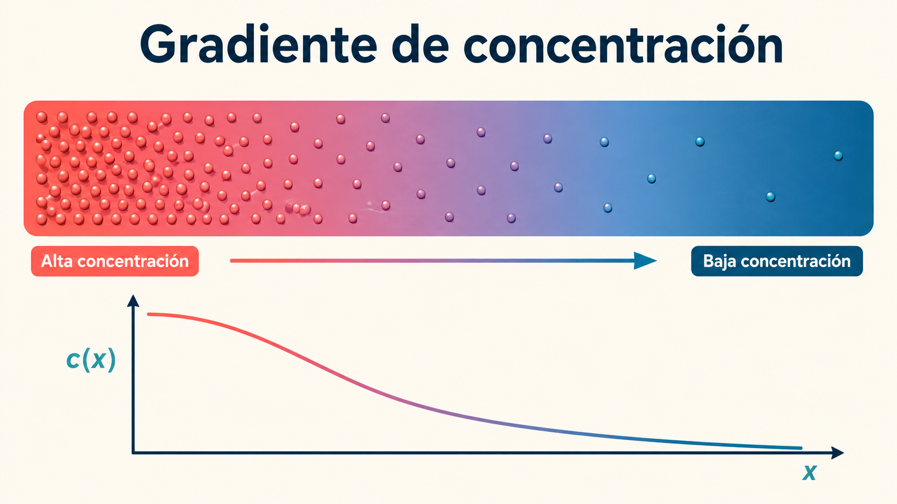
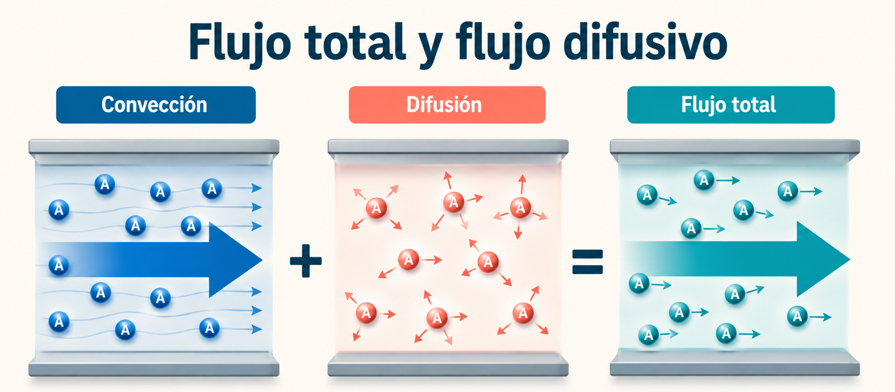
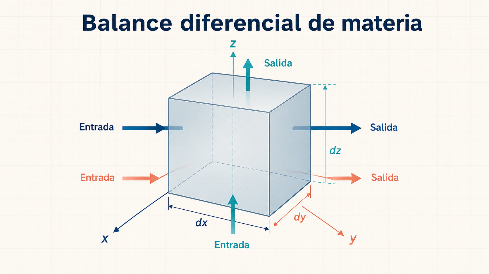
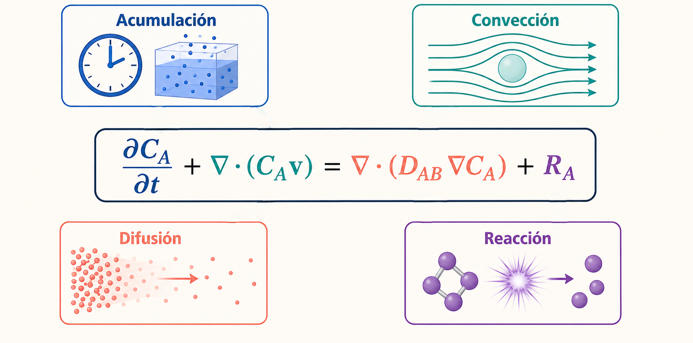
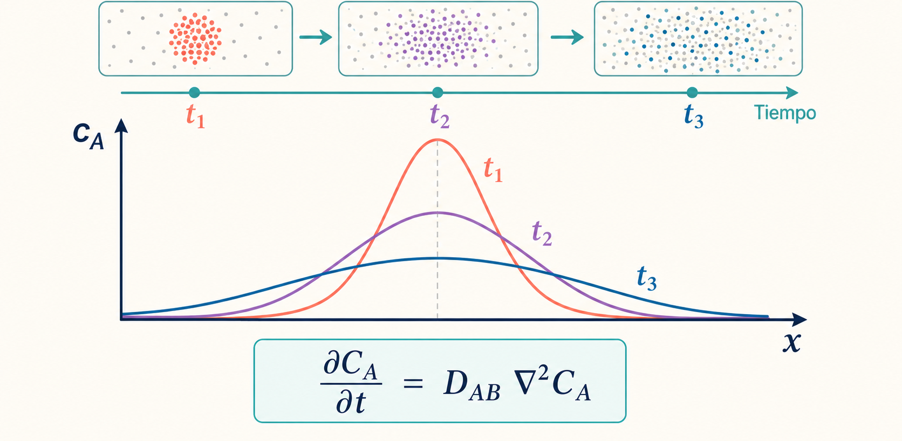

import DifusionMolecular from "../../components/visualizations/DifusionMolecular.astro";
import MolecularDiffusion from "../../components/visualizations/MolecularDiffusion.astro";

# Lección 2. Fundamentos de la transferencia de masa por difusión molecular

## Objetivos de aprendizaje

Al finalizar esta lección, el estudiante será capaz de:

* Comprender el fenómeno físico de la difusión molecular.
* Diferenciar entre transporte convectivo y transporte difusivo.
* Interpretar las ecuaciones fundamentales de transferencia de masa.
* Comprender el significado físico de cada término presente en las ecuaciones.
* Aplicar las ecuaciones de difusión para analizar problemas de ingeniería.

---

# 1. ¿Qué es la transferencia de masa?

La transferencia de masa es el proceso mediante el cual una especie química se desplaza desde una región donde su concentración es elevada hacia otra donde su concentración es menor. Este fenómeno ocurre de manera natural debido al movimiento aleatorio de las moléculas.

<DifusionMolecular/>

La difusión molecular constituye uno de los mecanismos fundamentales de transporte de materia y está presente en numerosos procesos industriales, tales como:

* Absorción de gases.
* Destilación.
* Extracción líquido-líquido.
* Secado de materiales.
* Separación mediante membranas.
* Reactores químicos.
* Procesos biológicos.

La fuerza impulsora de la difusión es el **gradiente de concentración**.

Mientras mayor sea la diferencia de concentración entre dos puntos, mayor será la velocidad de transferencia de masa.

---

# 2. Primera Ley de Fick: la ecuación fundamental de la difusión

La descripción matemática de la difusión molecular comienza con la Primera Ley de Fick.

$$
J_A=-D_{AB}\frac{dC_A}{dz}
$$

Esta ecuación establece que el flujo difusivo es proporcional al gradiente de concentración.

## Interpretación física

Si la concentración disminuye conforme aumenta la posición $z$, las moléculas se desplazan espontáneamente desde la zona de mayor concentración hacia la de menor concentración.

El signo negativo indica precisamente esta dirección natural del transporte.

---

## Significado de cada término

### $J_A$

Flujo difusivo del componente A.

Representa la cantidad de materia que atraviesa una unidad de área por unidad de tiempo debido únicamente a la difusión molecular.

Unidades típicas:

$$
\frac{mol}{m^2\cdot s}
$$

---

### $D_{AB}$

Coeficiente de difusión del componente A en el componente B.

Describe la facilidad con la que A puede difundirse dentro de B.

Depende de:

* temperatura,
* presión,
* naturaleza de ambos componentes,
* estado físico del sistema.

Unidades:

$$
m^2/s
$$

Valores grandes indican una difusión rápida.

---

### $C_A$

Concentración molar del componente A.

Corresponde a la cantidad de moles de A presentes por unidad de volumen.

Unidades:

$$
mol/m^3
$$

---

### $\frac{dC_A}{dz}$

Gradiente de concentración.

Mide qué tan rápidamente cambia la concentración con la distancia.

Un gradiente elevado produce una difusión intensa.

---

# 3. Flujo total y flujo difusivo

En un sistema real, una especie puede desplazarse por dos mecanismos simultáneamente:

* movimiento del fluido $convección$,
* difusión molecular.

El flujo total del componente A puede expresarse como

$$
N_A=Nx_A+J_A
$$

---

## Interpretación

Esta ecuación indica que el flujo total es la suma de dos contribuciones:

* transporte por movimiento global del fluido;
* transporte debido a la difusión.

En muchos procesos industriales ambos mecanismos ocurren simultáneamente.

---

## Significado de los términos

### $N_A$

Flujo molar total del componente A.

Incluye convección y difusión.

---

### $N$

Flujo molar total de la mezcla.

Se obtiene mediante

$$
N=N_A+N_B
$$

donde:

* $N_A$ es el flujo del componente A.
* $N_B$ es el flujo del componente B.

---

### $x_A$

Fracción molar del componente A.

Representa la proporción de A dentro de la mezcla.

Su valor siempre está entre 0 y 1.

---

### $J_A$

Flujo debido exclusivamente a la difusión.

---

# 4. Flujo total considerando difusión

Al sustituir la Primera Ley de Fick en la expresión anterior se obtiene

$$
N_A=(N_A+N_B)x_A-D_{AB}\frac{dC_A}{dz}
$$

Esta ecuación muestra claramente que el transporte total es consecuencia de:

* movimiento global de la mezcla,
* difusión molecular.

<MolecularDiffusion/>
---

# 5. Difusión equimolar

En numerosos procesos de ingeniería ocurre que un componente difunde exactamente en sentido opuesto al otro.

En esas condiciones

$$
J_A=-J_B
$$

Esto significa que la cantidad de A que avanza es exactamente igual a la cantidad de B que retrocede.

Cuando además la concentración total permanece constante,

$$
C_A+C_B=\text{constante}
$$

los coeficientes de difusión son iguales:

$$
D_{AB}=D_{BA}
$$

Esta simplificación es ampliamente utilizada en problemas de ingeniería química.

---

# 6. El principio de conservación de la materia

Toda la teoría de transferencia de masa se fundamenta en el principio de conservación de la materia.

La idea puede resumirse mediante el siguiente balance:

$$
\text{Entrada}
-
\text{Salida}
+
\text{Generación}
=

\text{Acumulación}
$$

Esta relación constituye la base de todos los balances diferenciales empleados en transporte de masa.

---

# 7. Balance diferencial de materia

Para un componente cualquiera, el balance diferencial puede escribirse como

$$
M_A
\left(
\frac{\partial N_{Ax}}{\partial x}
+
\frac{\partial N_{Ay}}{\partial y}
+
\frac{\partial N_{Az}}{\partial z}
\right)
+
\frac{\partial \rho_A}{\partial t}
=

M_A R_A
$$

---

## Interpretación física

Esta ecuación expresa que cualquier cambio en la cantidad de una especie dentro de un volumen de control puede deberse a:

* entrada o salida por transporte,
* generación mediante reacción química,
* acumulación temporal.

---

## Significado de los términos

### $N_{Ax},N_{Ay},N_{Az}$

Componentes del flujo molar en las direcciones $x$, $y$ y $z$.

---

### $\rho_A$

Densidad másica del componente A.

---

### $R_A$

Velocidad de generación o consumo debido a reacción química.

* positiva: producción;
* negativa: consumo.

---

### $M_A$

Peso molecular del componente A.

Permite convertir entre magnitudes molares y másicas.

---

# 8. Continuidad para toda la mezcla

Cuando se consideran todas las especies presentes, el balance conduce a la ecuación general de continuidad

$$
\rho
\left(
\frac{\partial u_x}{\partial x}
+
\frac{\partial u_y}{\partial y}
+
\frac{\partial u_z}{\partial z}
\right)
+
u_x\frac{\partial\rho}{\partial x}
+
u_y\frac{\partial\rho}{\partial y}
+
u_z\frac{\partial\rho}{\partial z}
+
\frac{\partial\rho}{\partial t}
=

0
$$

---

## Interpretación

Esta ecuación garantiza que la masa total del sistema permanece constante.

No puede crearse ni destruirse masa; únicamente puede desplazarse.

---

## Significado de los términos

### $\rho$

Densidad de la mezcla.

---

### $u_x,u_y,u_z$

Componentes de la velocidad del fluido.

---

### $\frac{\partial\rho}{\partial t}$

Cambio temporal de la densidad.

---

### $\frac{\partial u}{\partial x}$

Representan la variación espacial de la velocidad.

---

# 9. Caso especial: fluidos incompresibles

Cuando la densidad permanece constante,

$$
\frac{\partial u_x}{\partial x}
+
\frac{\partial u_y}{\partial y}
+
\frac{\partial u_z}{\partial z}
=

0
$$

Esta expresión es ampliamente utilizada en ingeniería porque simplifica considerablemente los problemas de flujo.

---

# 10. Ecuación general de transporte de masa

Al combinar difusión, convección y reacción química se obtiene

$$
\frac{\partial C_A}{\partial t}
+
u_x\frac{\partial C_A}{\partial x}
+
u_y\frac{\partial C_A}{\partial y}
+
u_z\frac{\partial C_A}{\partial z}
=

D_{AB}
\left(
\frac{\partial^2 C_A}{\partial x^2}
+
\frac{\partial^2 C_A}{\partial y^2}
+
\frac{\partial^2 C_A}{\partial z^2}
\right)
+
R_A
$$

Esta es una de las ecuaciones más importantes de la transferencia de masa.

---

## Interpretación física

Cada término posee un significado muy claro:

### $\frac{\partial C_A}{\partial t}$

Cambio temporal de la concentración.

---

### $u_x\frac{\partial C_A}{\partial x}+u_y\frac{\partial C_A}{\partial y}+u_z\frac{\partial C_A}{\partial z}$

Transporte por convección.

Describe cómo el movimiento del fluido arrastra al componente A.

---

### $D_{AB}\nabla^2 C_A$

Difusión molecular.

El operador laplaciano

$$
\nabla^2C_A=
\frac{\partial^2C_A}{\partial x^2}
+
\frac{\partial^2C_A}{\partial y^2}
+
\frac{\partial^2C_A}{\partial z^2}
$$

representa la difusión en las tres dimensiones espaciales.

---

### $R_A$

Producción o consumo por reacción química.

---

# 11. Segunda Ley de Fick

Cuando el fluido permanece inmóvil y no existen reacciones químicas, la ecuación anterior se simplifica a

$$
\frac{\partial C_A}{\partial t}
=

D_{AB}
\left(
\frac{\partial^2C_A}{\partial x^2}
+
\frac{\partial^2C_A}{\partial y^2}
+
\frac{\partial^2C_A}{\partial z^2}
\right)
$$

Esta ecuación describe cómo evoluciona la concentración con el tiempo únicamente debido a la difusión.

---

## Interpretación física

La Segunda Ley de Fick permite responder preguntas fundamentales como:

* ¿Cuánto tarda un soluto en difundirse?
* ¿Cómo cambia la concentración con el tiempo?
* ¿Cómo evoluciona el perfil de concentración dentro de un sólido o un fluido?

Es una ecuación fundamental en ingeniería química, ciencia de materiales, biotecnología, ingeniería ambiental y procesos farmacéuticos.

---

# 12. Relación entre transferencia de masa y transferencia de calor

La ecuación general de transferencia de calor tiene una forma matemática muy similar:

$$
\frac{\partial T}{\partial t}
+
u_x\frac{\partial T}{\partial x}
+
u_y\frac{\partial T}{\partial y}
+
u_z\frac{\partial T}{\partial z}
=

\alpha
\left(
\frac{\partial^2T}{\partial x^2}
+
\frac{\partial^2T}{\partial y^2}
+
\frac{\partial^2T}{\partial z^2}
\right)
+
\frac{Q}{\rho C_p}
$$

Esta analogía pone de manifiesto que los mecanismos físicos que gobiernan el transporte de masa y de energía son conceptualmente equivalentes: ambos combinan acumulación, transporte por convección, difusión y posibles fuentes o sumideros internos.

---

# Conclusiones

Las ecuaciones desarrolladas constituyen la base de la teoría moderna de la transferencia de masa. La Primera Ley de Fick describe el flujo difusivo generado por un gradiente de concentración, mientras que la Segunda Ley de Fick explica cómo evoluciona la concentración con el tiempo. La ecuación general de transporte integra los efectos de difusión, convección y reacción química, proporcionando un modelo completo para analizar la mayoría de los procesos industriales. Finalmente, los balances diferenciales de materia garantizan el cumplimiento del principio de conservación de la masa y sirven como fundamento para el diseño y análisis de equipos de separación, reactores, sistemas ambientales y procesos biotecnológicos.
