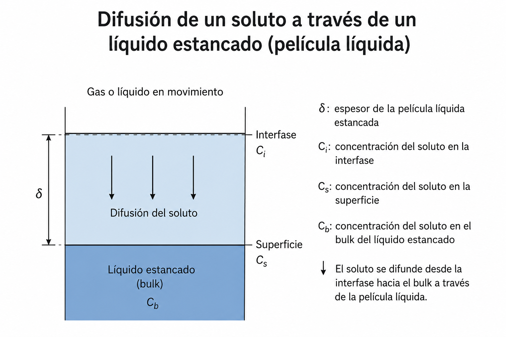
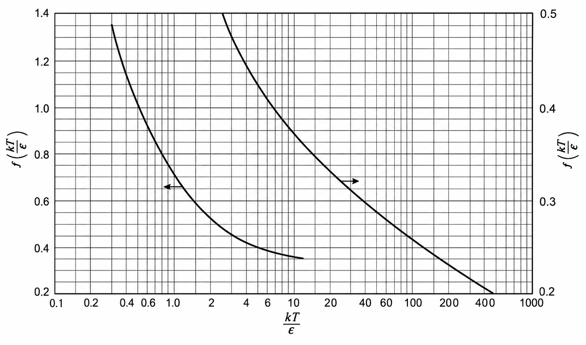

import Difusion from "../../components/visualizations/Difusion.astro";

# Lección 3. Difusión molecular en estado estacionario

## Objetivos de aprendizaje

Al finalizar esta lección, el estudiante será capaz de:

* Reconocer las condiciones que caracterizan la difusión en estado estacionario.
* Distinguir entre difusión a través de un componente estancado y contradifusión equimolar.
* Formular ecuaciones de flujo para gases y líquidos.
* Interpretar el origen de los términos logarítmicos presentes en algunos modelos de difusión.
* Estimar coeficientes de difusión mediante correlaciones empíricas.
* Comprender el efecto de la composición y de la no idealidad en soluciones concentradas.

---

# 1. Significado del estado estacionario

Un proceso de difusión se encuentra en estado estacionario cuando la concentración en cada punto del sistema no cambia con el tiempo. Esto no significa que las moléculas estén inmóviles, sino que el flujo de materia permanece constante.

Matemáticamente, para el componente $A$,

$$
\frac{\partial C_A}{\partial t}=0
$$

donde:

* $C_A$ es la concentración molar de $A$;
* $t$ es el tiempo.

En ausencia de reacción química y para difusión unidimensional, el balance de materia conduce a

$$
\frac{dN_A}{dz}=0
$$

Por tanto,

$$
N_A=\text{constante}
$$

Aquí:

* $N_A$ es el flujo molar total de $A$;
* $z$ es la coordenada espacial en la dirección de la transferencia.

Esta condición permite integrar las ecuaciones diferenciales y obtener expresiones algebraicas para calcular el flujo.

<Difusion/>

---

# 2. Ecuación general para difusión binaria estacionaria

Para una mezcla binaria de los componentes $A$ y $B$, el flujo molar total de $A$ puede expresarse como

$$
N_A=(N_A+N_B)y_A
-

CD_{AB}\frac{dy_A}{dz}
$$

Esta ecuación contiene las dos formas principales de transporte:

$$
\text{flujo total}
=

\text{transporte por movimiento global}
+
\text{difusión molecular}
$$

## Significado de los términos

* $N_A$: flujo molar total del componente $A$.
* $N_B$: flujo molar total del componente $B$.
* $y_A$: fracción molar de $A$.
* $C$: concentración molar total de la mezcla.
* $D_{AB}$: difusividad molecular de $A$ en $B$.
* $z$: distancia medida en la dirección de difusión.
* $dy_A/dz$: gradiente espacial de fracción molar.

El primer término del lado derecho representa el transporte asociado con el movimiento molar neto de la mezcla. El segundo representa la difusión causada por una diferencia de composición.

Como $C_A=Cy_A$, si la concentración total es constante también puede escribirse

$$
N_A=(N_A+N_B)\frac{C_A}{C}
-

D_{AB}\frac{dC_A}{dz}
$$

Al reorganizar esta ecuación se obtiene

$$
\frac{dC_A}
{N_AC-C_A(N_A+N_B)}
=

-\frac{dz}{CD_{AB}}
$$

La integración entre dos posiciones produce

$$
\int_{C_{A1}}^{C_{A2}}
\frac{dC_A}
{N_AC-C_A(N_A+N_B)}
=

-\int_{z_1}^{z_2}
\frac{dz}{CD_{AB}}
$$

donde:

* $C_{A1}$ y $C_{A2}$ son las concentraciones de $A$ en los extremos;
* $z_1$ y $z_2$ son las posiciones de esos extremos.

El espesor de la región de difusión es

$$
L=z_2-z_1
$$

Se utiliza $L$ para evitar confundir el espesor total con la coordenada variable $z$.

Si $D_{AB}$, $C$, $N_A$ y $N_B$ son constantes, la integración conduce a

$$
N_A=
\frac{(N_A+N_B)D_{AB}C}{L}
\ln
\left[
\frac{
\dfrac{N_A}{N_A+N_B}-\dfrac{C_{A2}}{C}
}{
\dfrac{N_A}{N_A+N_B}-\dfrac{C_{A1}}{C}
}
\right]
$$

Esta expresión es general, pero contiene $N_A$ en ambos lados. Por ello, en la práctica suele aplicarse después de especificar la relación física entre $N_A$ y $N_B$.

Los casos más importantes son:

1. difusión de $A$ a través de $B$ estancado;
2. contradifusión equimolar.

---

# 3. Difusión estacionaria en gases

Para una mezcla gaseosa ideal, la concentración total está relacionada con la presión total mediante

$$
C=\frac{P}{RT}
$$

donde:

* $P$ es la presión total;
* $R$ es la constante universal de los gases;
* $T$ es la temperatura absoluta.

La presión parcial de $A$ es

$$
p_A=y_AP
$$

donde:

* $p_A$ es la presión parcial de $A$;
* $y_A$ es su fracción molar en la fase gaseosa.

Al combinar estas relaciones,

$$
C_A=\frac{p_A}{RT}
$$

Por tanto,

$$
\frac{dC_A}{dz}
=

\frac{1}{RT}\frac{dp_A}{dz}
$$

si la temperatura permanece constante.

La ecuación general de flujo se convierte en

$$
N_A=(N_A+N_B)\frac{p_A}{P}
-

\frac{D_{AB}}{RT}\frac{dp_A}{dz}
$$

Esta forma es especialmente útil porque las condiciones de frontera en sistemas gaseosos suelen expresarse mediante presiones parciales.

---

# 4. Difusión de un gas a través de otro gas estancado

Considérese que el componente $A$ se difunde a través de una capa de $B$, mientras que $B$ no presenta flujo molar neto.

La condición física es

$$
N_B=0
$$

Entonces,

$$
N_A+N_B=N_A
$$

La ecuación de flujo queda

$$
N_A=N_A\frac{p_A}{P}
-

\frac{D_{AB}}{RT}\frac{dp_A}{dz}
$$

Al reagrupar,

$$
N_A\left(1-\frac{p_A}{P}\right)
=

-\frac{D_{AB}}{RT}\frac{dp_A}{dz}
$$

Como

$$
1-\frac{p_A}{P}
=

\frac{P-p_A}{P}
$$

se obtiene

$$
N_A
=

-\frac{D_{AB}P}{RT(P-p_A)}
\frac{dp_A}{dz}
$$

Integrando entre los extremos de una película de espesor $L$,

$$
N_A=
\frac{D_{AB}P}{RTL}
\ln
\left(
\frac{P-p_{A2}}
{P-p_{A1}}
\right)
$$

## Interpretación del resultado

El término logarítmico aparece porque la fracción del gas estancado cambia a lo largo de la película.

Aunque $B$ no tiene flujo molar neto, su concentración no tiene que ser constante. A medida que cambia la cantidad de $A$, también cambia localmente la cantidad de $B$.

---

# 5. Presión parcial del componente estancado

En una mezcla binaria,

$$
p_B=P-p_A
$$

Por tanto, en los dos extremos,

$$
p_{B1}=P-p_{A1}
$$

$$
p_{B2}=P-p_{A2}
$$

La ecuación de difusión puede escribirse como

$$
N_A=
\frac{D_{AB}P}{RTL}
\ln
\left(
\frac{p_{B2}}{p_{B1}}
\right)
$$

Para obtener una forma semejante a la ley de Fick, se introduce la presión parcial media logarítmica de $B$:

$$
p_{B,\mathrm{lm}}
=

\frac{p_{B2}-p_{B1}}
{\ln(p_{B2}/p_{B1})}
$$

El subíndice $\mathrm{lm}$ indica una media logarítmica.

De esta definición,

$$
\ln\left(\frac{p_{B2}}{p_{B1}}\right)
==

\frac{p_{B2}-p_{B1}}{p_{B,\mathrm{lm}}}
$$

Como

$$
p_{B2}-p_{B1}=p_{A1}-p_{A2}
$$

el flujo puede expresarse como

$$
N_A=
\frac{D_{AB}P}
{RTL,p_{B,\mathrm{lm}}}
\left(p_{A1}-p_{A2}\right)
$$

## Interpretación de cada término

* $D_{AB}$: facilidad con la que $A$ se difunde en $B$.
* $P$: presión total de la mezcla.
* $p_{A1}-p_{A2}$: fuerza impulsora expresada como diferencia de presiones parciales.
* $L$: distancia que debe atravesar el componente.
* $p_{B,\mathrm{lm}}$: corrección por la variación de la concentración del componente estancado.
* $RT$: factor que convierte presión parcial en concentración molar.

El flujo aumenta al incrementar la difusividad o la diferencia de presión parcial y disminuye al aumentar el espesor de la película.

---

# 6. Significado de la media logarítmica

La media logarítmica se utiliza cuando una variable cambia de manera no lineal entre dos extremos.

Para dos valores positivos $a_1$ y $a_2$,

$$
a_{\mathrm{lm}}
=

\frac{a_2-a_1}
{\ln(a_2/a_1)}
$$

Si $a_1$ y $a_2$ son muy parecidos, entonces

$$
a_{\mathrm{lm}}\approx \frac{a_1+a_2}{2}
$$

Sin embargo, cuando la diferencia es considerable, no debe sustituirse automáticamente por la media aritmética.

En difusión a través de un componente estancado, esta media corrige la resistencia al transporte provocada por el cambio de composición a lo largo de la película.

---

# 7. Contradifusión equimolar en gases

La contradifusión equimolar ocurre cuando los dos componentes se desplazan en sentidos opuestos con flujos molares de la misma magnitud:

$$
N_A=-N_B
$$

Por tanto,

$$
N_A+N_B=0
$$

No existe movimiento molar neto de la mezcla, aunque ambos componentes se estén difundiendo.

La ecuación general

$$
N_A=(N_A+N_B)\frac{p_A}{P}
-

\frac{D_{AB}}{RT}\frac{dp_A}{dz}
$$

se reduce a

$$
N_A=
-\frac{D_{AB}}{RT}\frac{dp_A}{dz}
$$

Si $D_{AB}$ y $T$ son constantes, la integración a través de un espesor $L$ proporciona

$$
N_A=
\frac{D_{AB}}{RTL}
\left(p_{A1}-p_{A2}\right)
$$

Simultáneamente,

$$
N_B=-N_A
$$

## Interpretación

Esta expresión es lineal porque no existe flujo molar global de la mezcla. La transferencia se debe únicamente al gradiente de composición.

El flujo aumenta cuando:

* aumenta $D_{AB}$;
* aumenta la diferencia $p_{A1}-p_{A2}$;
* disminuye el espesor $L$.

La contradifusión equimolar puede aparecer cuando dos gases intercambian posiciones sin que exista un desplazamiento molar neto del conjunto.

---

# 8. Comparación de los principales casos gaseosos

## Componente $B$ estancado

$$
N_B=0
$$

$$
N_A=
\frac{D_{AB}P}{RTL}
\ln
\left(
\frac{P-p_{A2}}{P-p_{A1}}
\right)
$$

La ecuación contiene un término logarítmico porque existe un movimiento molar neto asociado con el transporte de $A$.

---

## Contradifusión equimolar

$$
N_A=-N_B
$$

$$
N_A=
\frac{D_{AB}}{RTL}
(p_{A1}-p_{A2})
$$

La expresión es lineal porque el flujo molar total es cero.

Seleccionar correctamente el caso físico es esencial. No debe aplicarse la ecuación de contradifusión equimolar cuando uno de los componentes está estancado.

---

# 9. Difusión en mezclas multicomponentes

En una mezcla con más de dos especies, el movimiento de $A$ depende de su interacción con todos los demás componentes.

Puede definirse una difusividad efectiva mediante

$$
D_{A,m}
=

\frac{
N_A-y_A\displaystyle\sum_{i=1}^{n}N_i
}{
\displaystyle\sum_{\substack{i=1,i\neq A}}^{n}
\frac{y_iN_A-y_AN_i}{D_{Ai}}
}
$$

donde:

* $D_{A,m}$ es la difusividad efectiva de $A$ en la mezcla;
* $D_{Ai}$ es la difusividad binaria de $A$ con respecto al componente $i$;
* $y_i$ es la fracción molar del componente $i$;
* $N_i$ es el flujo molar del componente $i$;
* $n$ es el número total de especies.

Esta ecuación muestra que la difusividad efectiva no depende solamente de las difusividades binarias. También depende de la composición y de los flujos de las especies.

---

## Componentes acompañantes estancados

Cuando todos los componentes excepto $A$ están estancados,

$$
N_i=0
\qquad
(i\neq A)
$$

la difusividad efectiva se simplifica a

$$
D_{A,m}
=

\frac{1-y_A}
{\displaystyle\sum_{\substack{i=1,i\neq A}}^{n}
\frac{y_i}{D_{Ai}}}
$$

También puede definirse una fracción molar sobre una base libre de $A$:

$$
y_i'=\frac{y_i}{1-y_A}
$$

Entonces,

$$
D_{A,m}
=

\frac{1}
{\displaystyle\sum_{\substack{i=1,i\neq A}}^{n}
\frac{y_i'}{D_{Ai}}}
$$

## Interpretación

Esta expresión tiene la forma de una media armónica ponderada. Un componente con una difusividad binaria pequeña puede aumentar notablemente la resistencia total, incluso si su concentración no es dominante.

---

# 10. Estimación de la difusividad en gases

La difusividad gaseosa puede calcularse experimentalmente o estimarse mediante correlaciones basadas en teoría cinética.

En términos generales, estas correlaciones tienen la estructura

$$
D_{AB}
\propto
\frac{
T^{3/2}
\sqrt{\dfrac{1}{M_A}+\dfrac{1}{M_B}}
}{
P\sigma_{AB}^{2}\Omega_D
}
$$

donde:

* $T$ es la temperatura absoluta;
* $M_A$ y $M_B$ son las masas molares;
* $P$ es la presión total;
* $\sigma_{AB}$ es un diámetro molecular efectivo;
* $\Omega_D$ es una integral o función de colisión.

Una correlación tipo Wilke–Lee puede representarse como

$$
D_{AB}
=

\frac{
10^{-4}
\left[
1.084
-

0.249
\sqrt{
\frac{1}{M_A}+\frac{1}{M_B}
}
\right]
T^{3/2}
\sqrt{
\frac{1}{M_A}+\frac{1}{M_B}
}
}{
Pr_{AB}^{2}
f\left(\dfrac{kT}{\varepsilon_{AB}}\right)
}
$$

La forma numérica exacta depende de las unidades empleadas.

## Parámetros de interacción molecular

El radio medio de colisión se calcula como

$$
r_{AB}=\frac{r_A+r_B}{2}
$$

La energía de interacción combinada se estima mediante

$$
\varepsilon_{AB}
=

\sqrt{\varepsilon_A\varepsilon_B}
$$

donde:

* $r_A$ y $r_B$ son parámetros de tamaño molecular;
* $\varepsilon_A$ y $\varepsilon_B$ son parámetros de energía;
* $k$ es la constante de Boltzmann;
* $f(kT/\varepsilon_{AB})$ representa el efecto de las colisiones moleculares.

Cuando no se dispone de los parámetros moleculares, pueden estimarse mediante

$$
r=1.18,v^{1/3}
$$

y

$$
\frac{\varepsilon}{k}=1.21T_b
$$

donde:

* $v$ es el volumen molar del líquido en su punto normal de ebullición;
* $T_b$ es la temperatura normal de ebullición en kelvin.

---

## Tendencias físicas de la difusividad gaseosa

De las correlaciones anteriores se deduce que:

$$
D_{AB}\uparrow
\quad\text{cuando}\quad
T\uparrow
$$

y aproximadamente,

$$
D_{AB}\downarrow
\quad\text{cuando}\quad
P\uparrow
$$

Por tanto, los gases se difunden con mayor rapidez a temperaturas elevadas y con menor rapidez a presiones altas.

La difusividad también tiende a disminuir cuando las moléculas son grandes o presentan interacciones intermoleculares intensas.

---

# 11. Difusión molecular estacionaria en líquidos

La formulación básica para líquidos es similar a la empleada en gases, pero existen diferencias físicas importantes:

* las concentraciones molares son mucho mayores;
* las moléculas están más próximas;
* las interacciones intermoleculares son más intensas;
* las difusividades son considerablemente menores;
* la viscosidad ejerce una influencia importante.

La concentración molar total de una solución líquida puede aproximarse mediante

$$
C=\frac{\rho}{\overline{M}}
$$

donde:

* $\rho$ es la densidad de la solución;
* $\overline{M}$ es la masa molar promedio de la mezcla.

En muchos cálculos se emplea un valor medio:

$$
C_{\mathrm{av}}
=

\left(\frac{\rho}{\overline{M}}\right)_{\mathrm{av}}
$$

---

# 12. Difusión de un soluto a través de un líquido estancado

Considérese que $A$ se difunde a través de un líquido $B$ que no presenta flujo molar neto:

$$
N_B=0
$$

Para una concentración total aproximadamente constante, el flujo se expresa como

$$
N_A=
\frac{D_{AB}C_{\mathrm{av}}}
{L,x_{B,\mathrm{lm}}}
(x_{A1}-x_{A2})
$$

o, sustituyendo la concentración total,

$$
N_A=
\frac{D_{AB}}
{L,x_{B,\mathrm{lm}}}
\left(
\frac{\rho}{\overline{M}}
\right)*{\mathrm{av}}
(x*{A1}-x_{A2})
$$

donde:

* $x_{A1}$ y $x_{A2}$ son las fracciones molares de $A$ en los extremos;
* $x_{B,\mathrm{lm}}$ es la media logarítmica de la fracción molar de $B$;
* $L$ es el espesor de la película líquida.

La media logarítmica se define como

$$
x_{B,\mathrm{lm}}
=

\frac{x_{B2}-x_{B1}}
{\ln(x_{B2}/x_{B1})}
$$

## Interpretación

El factor

$$
\frac{1}{x_{B,\mathrm{lm}}}
$$

es una corrección por el hecho de que el componente $B$ está estancado. Cuando la cantidad de $B$ disminuye, esta corrección puede incrementar el flujo de $A$ respecto a una aplicación directa y simplificada de la ley de Fick.

---

# 13. Contradifusión equimolar en líquidos

Cuando

$$
N_A=-N_B
$$

el flujo molar total es cero y desaparece la contribución convectiva molar.

El flujo se expresa como

$$
N_A=
\frac{D_{AB}}{L}
(C_{A1}-C_{A2})
$$

Si se utilizan fracciones molares,

$$
N_A=
\frac{D_{AB}}{L}
\left(
\frac{\rho}{\overline{M}}
\right)*{\mathrm{av}}
(x*{A1}-x_{A2})
$$

donde:

* $C_{A1}$ y $C_{A2}$ son las concentraciones molares de $A$;
* $x_{A1}$ y $x_{A2}$ son sus fracciones molares;
* $D_{AB}$ es la difusividad de $A$ en $B$;
* $L$ es la distancia de difusión.

Esta es la forma integrada de la ley de Fick para un perfil lineal de concentración.

---

# 14. Estimación de la difusividad en líquidos diluidos

Para soluciones diluidas de no electrolitos, una correlación ampliamente utilizada es la de Wilke–Chang:

$$
D_{AB}^{\infty}
=

\frac{
117.3\times10^{-18}
(\phi M_B)^{1/2}T
}{
\mu_B,v_A^{0.6}
}
$$

La constante numérica depende del sistema de unidades. En una aplicación práctica debe comprobarse cuidadosamente que todas las variables se introduzcan en las unidades requeridas por la correlación.

## Significado de los términos

* $D_{AB}^{\infty}$: difusividad de $A$ a dilución infinita en $B$.
* $M_B$: masa molar del disolvente.
* $T$: temperatura absoluta.
* $\mu_B$: viscosidad del disolvente.
* $v_A$: volumen molar del soluto en su punto normal de ebullición.
* $\phi$: factor de asociación del disolvente.

Valores comunes del factor de asociación son

$$
\phi=2.26
\qquad
\text{para agua}
$$

$$
\phi=1.9
\qquad
\text{para metanol}
$$

$$
\phi=1.5
\qquad
\text{para etanol}
$$

$$
\phi=1.0
\qquad
\text{para disolventes no asociados}
$$

---

## Interpretación de la correlación

La ecuación muestra que

$$
D_{AB}^{\infty}\propto T
$$

Por tanto, la difusión tiende a aumentar con la temperatura.

También muestra que

$$
D_{AB}^{\infty}\propto \frac{1}{\mu_B}
$$

De esta manera, una mayor viscosidad produce una menor movilidad molecular.

Además,

$$
D_{AB}^{\infty}\propto \frac{1}{v_A^{0.6}}
$$

Por ello, los solutos de mayor tamaño tienden a difundirse más lentamente.

---

# 15. Difusión en soluciones concentradas

En una solución diluida, la interacción entre moléculas de soluto puede ser pequeña. En una solución concentrada, esas interacciones adquieren importancia y la ley de Fick debe corregirse para considerar la no idealidad termodinámica.

Una expresión para la difusividad efectiva es

$$
D=
\left(D_{AB}^{\infty}\right)^{x_B}
\left(D_{BA}^{\infty}\right)^{x_A}
\left[
1+
\frac{d\ln\gamma_A}
{d\ln x_A}
\right]
$$

donde:

* $D$ es la difusividad efectiva en la solución concentrada;
* $D_{AB}^{\infty}$ es la difusividad de $A$ a dilución infinita en $B$;
* $D_{BA}^{\infty}$ es la difusividad de $B$ a dilución infinita en $A$;
* $x_A$ y $x_B$ son las fracciones molares;
* $\gamma_A$ es el coeficiente de actividad de $A$.

El término

$$
1+
\frac{d\ln\gamma_A}{d\ln x_A}
$$

se denomina factor termodinámico.

---

## Interpretación del factor termodinámico

En una solución ideal,

$$
\gamma_A=1
$$

y no cambia con la composición. En consecuencia,

$$
\frac{d\ln\gamma_A}{d\ln x_A}=0
$$

y el factor termodinámico es igual a uno.

En una solución no ideal, el coeficiente de actividad cambia con la composición. Por ello, la fuerza impulsora real no depende solamente del gradiente de concentración, sino también del gradiente de potencial químico.

Esta distinción es especialmente importante en mezclas concentradas, soluciones poliméricas, sistemas electrolíticos y mezclas con interacciones moleculares fuertes.

---

# 16. Coeficiente de actividad a partir del equilibrio vapor-líquido

Para un componente en equilibrio entre una fase líquida y una fase de vapor, una forma modificada de la ley de Raoult es

$$
p_A=x_A\gamma_A P_A^{*}
$$

donde:

* $p_A$ es la presión parcial real del componente $A$;
* $x_A$ es su fracción molar en la fase líquida;
* $\gamma_A$ es su coeficiente de actividad;
* $P_A^{*}$ es la presión de vapor del componente puro a la temperatura del sistema.

Despejando,

$$
\gamma_A=
\frac{p_A}{x_AP_A^{*}}
$$

Como

$$
p_A=y_AP
$$

también puede escribirse

$$
\gamma_A=
\frac{y_AP}{x_AP_A^{*}}
$$

donde:

* $y_A$ es la fracción molar de $A$ en el vapor;
* $P$ es la presión total.

---

## Interpretación del coeficiente de actividad

Si

$$
\gamma_A=1
$$

el componente presenta comportamiento ideal según la ley de Raoult.

Si

$$
\gamma_A>1
$$

el componente tiene una mayor tendencia a escapar de la fase líquida que la predicha para una solución ideal.

Si

$$
\gamma_A<1
$$

las interacciones en la fase líquida retienen con mayor intensidad al componente.

El coeficiente de actividad conecta la termodinámica de las soluciones con la transferencia de masa.

---

# 17. Procedimiento para resolver problemas de difusión estacionaria

## Paso 1. Identificar las fases

Determinar si la difusión ocurre en:

* una mezcla gaseosa;
* una solución líquida;
* una mezcla binaria;
* una mezcla multicomponente.

## Paso 2. Determinar la relación entre los flujos

Las condiciones más frecuentes son

$$
N_B=0
$$

para un componente estancado, o

$$
N_A=-N_B
$$

para contradifusión equimolar.

## Paso 3. Establecer la fuerza impulsora

En gases puede expresarse mediante:

$$
p_{A1}-p_{A2}
$$

o

$$
y_{A1}-y_{A2}
$$

En líquidos puede utilizarse:

$$
C_{A1}-C_{A2}
$$

o

$$
x_{A1}-x_{A2}
$$

## Paso 4. Determinar la difusividad

La difusividad puede proceder de:

* datos experimentales;
* tablas;
* una correlación para gases;
* una correlación para líquidos diluidos;
* una corrección para soluciones concentradas.

## Paso 5. Verificar los supuestos

Entre los supuestos comunes se encuentran:

* estado estacionario;
* transporte unidimensional;
* temperatura constante;
* presión constante;
* ausencia de reacción química;
* difusividad constante;
* concentración molar total aproximadamente constante;
* geometría plana.

## Paso 6. Comprobar las unidades

El flujo molar normalmente debe expresarse como

$$
\frac{\mathrm{mol}}{\mathrm{m^2,s}}
$$

o

$$
\frac{\mathrm{kmol}}{\mathrm{m^2,s}}
$$

El análisis dimensional es indispensable, especialmente cuando se utilizan correlaciones empíricas.

---

# 18. Ejemplo conceptual: evaporación a través de aire estancado

Considérese un líquido volátil $A$ que se evapora hacia una capa de aire $B$. Si el aire se considera estancado,

$$
N_B=0
$$

La presión parcial de $A$ junto a la superficie del líquido suele aproximarse mediante su presión de vapor:

$$
p_{A1}\approx P_A^{*}
$$

En el extremo exterior de la película,

$$
p_{A2}
$$

depende de la cantidad de vapor presente en el ambiente.

El flujo se calcula mediante

$$
N_A=
\frac{D_{AB}P}{RTL}
\ln
\left(
\frac{P-p_{A2}}
{P-p_{A1}}
\right)
$$

El modelo predice que la evaporación aumenta cuando:

* se incrementa la temperatura;
* se reduce el espesor de la película gaseosa;
* disminuye la concentración ambiental de $A$;
* aumenta la difusividad.

---

# 19. Ejemplo conceptual: dos gases en contradifusión

Supóngase que una película gaseosa separa dos regiones con distintas composiciones. El componente $A$ se difunde hacia la derecha y el componente $B$ hacia la izquierda, con flujos equimolares.

Entonces,

$$
N_A=-N_B
$$

y

$$
N_A=
\frac{D_{AB}}{RTL}
(p_{A1}-p_{A2})
$$

Si

$$
p_{A1}>p_{A2}
$$

entonces

$$
N_A>0
$$

para una dirección positiva definida desde el punto 1 hacia el punto 2.

El signo del flujo depende de la dirección elegida para el eje espacial. Por ello, siempre deben indicarse claramente el sistema de coordenadas y las condiciones de frontera.

---

# 20. Errores frecuentes

## Confundir estado estacionario con equilibrio

En estado estacionario puede existir un flujo constante:

$$
N_A\neq0
$$

En equilibrio no existe fuerza impulsora neta y, por tanto,

$$
N_A=0
$$

## Utilizar contradifusión equimolar cuando $B$ está estancado

Las condiciones

$$
N_B=0
$$

y

$$
N_A=-N_B
$$

representan situaciones diferentes y producen ecuaciones distintas.

## Omitir la media logarítmica

En la difusión a través de un componente estancado, la concentración de dicho componente varía. La media logarítmica representa esa variación.

## Usar grados Celsius en ecuaciones con $RT$

La temperatura debe ser absoluta:

$$
T[\mathrm{K}]
=

T[^\circ\mathrm{C}]+273.15
$$

## Aplicar una correlación sin revisar sus unidades

Las constantes empíricas cambian según el sistema de unidades. Una sustitución dimensional incorrecta puede producir errores de varios órdenes de magnitud.

## Confundir presión parcial con presión total

La presión parcial se calcula mediante

$$
p_A=y_AP
$$

y no debe sustituirse directamente por $P$, salvo que el gas sea puro.

---

# 21. Síntesis de las ecuaciones principales

## Gas $A$ a través de $B$ estancado

$$
N_B=0
$$

$$
N_A=
\frac{D_{AB}P}{RTL}
\ln
\left(
\frac{P-p_{A2}}
{P-p_{A1}}
\right)
$$

o

$$
N_A=
\frac{D_{AB}P}
{RTL,p_{B,\mathrm{lm}}}
(p_{A1}-p_{A2})
$$

## Contradifusión equimolar en gases

$$
N_A=-N_B
$$

$$
N_A=
\frac{D_{AB}}{RTL}
(p_{A1}-p_{A2})
$$

## Soluto $A$ a través de líquido $B$ estancado

$$
N_B=0
$$

$$
N_A=
\frac{D_{AB}}
{L,x_{B,\mathrm{lm}}}
\left(
\frac{\rho}{\overline{M}}
\right)*{\mathrm{av}}
(x*{A1}-x_{A2})
$$

## Contradifusión equimolar en líquidos

$$
N_A=-N_B
$$

$$
N_A=
\frac{D_{AB}}{L}
(C_{A1}-C_{A2})
$$

## Difusión líquida a dilución infinita

$$
D_{AB}^{\infty}
=

\frac{
117.3\times10^{-18}
(\phi M_B)^{1/2}T
}{
\mu_Bv_A^{0.6}
}
$$

## Difusividad en una solución concentrada

$$
D=
\left(D_{AB}^{\infty}\right)^{x_B}
\left(D_{BA}^{\infty}\right)^{x_A}
\left[
1+
\frac{d\ln\gamma_A}{d\ln x_A}
\right]
$$

---

# Conclusión

La difusión molecular en estado estacionario se caracteriza por un flujo constante y por la ausencia de acumulación temporal. La forma final de la ecuación de transporte depende de la relación entre los flujos de los componentes.

Cuando uno de los componentes está estancado, aparece una corrección logarítmica asociada con el movimiento molar neto y con la variación de la composición a través de la película. Cuando existe contradifusión equimolar, el flujo molar total es cero y la ecuación se reduce a una relación lineal entre el flujo y la diferencia de concentración o presión parcial.

En mezclas multicomponentes, la difusión de una especie depende de sus interacciones con todas las demás. En los gases, la difusividad está gobernada principalmente por la temperatura, la presión y las propiedades moleculares. En los líquidos, la viscosidad, el tamaño molecular y las interacciones entre soluto y disolvente adquieren mayor importancia.

Finalmente, en soluciones concentradas la concentración por sí sola no representa completamente la fuerza impulsora. Es necesario considerar la actividad química mediante un factor termodinámico, lo que conecta los principios de transferencia de masa con la termodinámica de soluciones.

# Tablas

### Tabla 3.1. Difusividad de gases a presión atmosférica estándar (101.3 kN/m²)

| Sistema               | Temp. (°C) | Difusividad (×10⁻⁵ m²/s) 
| --------------------- | ---------: | -----------------------: 
| H₂–CH₄                |          0 |                     6.25 
| O₂–N₂                 |          0 |                     1.81 
| CO–O₂                 |          0 |                     1.85 
| CO₂–O₂                |          0 |                     1.39 
| Aire–NH₃              |          0 |                     1.98 
| Aire–H₂O              |       25.9 |                     2.58 
| Aire–H₂O              |       59.0 |                     3.05 
| Aire–Etanol           |          0 |                     1.02 
| Aire–n-Butanol        |       25.9 |                     0.87 
| Aire–n-Butanol        |       59.0 |                     1.04 
| Aire–Acetato de etilo |       25.9 |                     0.87 
| Aire–Acetato de etilo |       59.0 |                     1.06 
| Aire–Anilina          |       25.9 |                     0.74 
| Aire–Anilina          |       59.0 |                     0.90 
| Aire–Clorobenceno     |       25.9 |                     0.74 
| Aire–Clorobenceno     |       59.0 |                     0.90 
| Aire–Tolueno          |       25.9 |                     0.86 
| Aire–Tolueno          |       59.0 |                     0.92 

---

### Tabla 3.2. Constantes de fuerza de gases determinadas a partir de datos de viscosidad

| Gas   | ε/k (K) | r (nm) | Gas | ε/k (K) | r (nm) |
| ----- | ------: | -----: | --- | ------: | -----: |
| Aire  |    78.6 | 0.3711 | HCl |   344.7 | 0.3339 |
| CCl₄  |   322.7 | 0.5947 | He  |   10.22 | 0.2551 |
| CH₃OH |   481.8 | 0.3626 | H₂  |    59.7 | 0.2827 |
| CH₄   |   148.6 | 0.3758 | H₂O |   809.1 | 0.2641 |
| CO    |    91.7 | 0.3690 | H₂S |   301.1 | 0.3623 |
| CO₂   |   195.2 | 0.3941 | NH₃ |   558.3 | 0.2900 |
| CS₂   |   467.0 | 0.4483 | NO  |   116.7 | 0.3492 |
| C₂H₆  |   215.7 | 0.4443 | N₂  |    71.4 | 0.3798 |
| C₃H₈  |   237.1 | 0.5118 | N₂O |   232.4 | 0.3828 |
| C₆H₆  |   412.3 | 0.5349 | O₂  |   106.7 | 0.3467 |
| Cl₂   |   316.0 | 0.4217 | SO₂ |   335.4 | 0.4112 |

---

### Tabla 3.3. Volúmenes atómicos y moleculares

| Componente                     | Volumen (×10⁻³ m³/kmol) |
| ------------------------------ | ----------------------: |
| Carbono                        |                    14.8 |
| Hidrógeno                      |                     3.7 |
| Cloro                          |                    24.6 |
| Bromo                          |                    27.0 |
| Yodo                           |                    37.0 |
| Azufre                         |                    25.6 |
| Nitrógeno                      |                    15.6 |
| Nitrógeno (aminas primarias)   |                    10.5 |
| Nitrógeno (aminas secundarias) |                    12.0 |
| Oxígeno                        |                     7.4 |
| Oxígeno en ésteres metílicos   |                     9.1 |
| Oxígeno en ésteres superiores  |                    11.0 |
| Oxígeno en ácidos              |                    12.0 |
| Anillo bencénico (restar)      |                      15 |
| Anillo naftalénico (restar)    |                      30 |

**Volúmenes moleculares**

| Molécula | Volumen (×10⁻³ m³/kmol) |
| -------- | ----------------------: |
| H₂       |                    14.3 |
| O₂       |                    25.6 |
| N₂       |                    31.2 |
| Aire     |                    29.9 |
| CO       |                    30.7 |
| CO₂      |                    34.0 |
| SO₂      |                    44.8 |
| NO       |                    23.6 |
| NH₃      |                    25.8 |
| H₂O      |                    18.9 |
| H₂S      |                    32.9 |
| COS      |                    51.5 |
| Cl₂      |                    48.4 |
| Br₂      |                    53.2 |
| I₂       |                    71.5 |

---

### Tabla 3.4. Difusividades de líquidos

| Soluto        | Disolvente | Temp. (°C) | Concentración (kmol/m³) | Difusividad (×10⁻⁹ m²/s) |
| ------------- | ---------- | ---------: | ----------------------: | -----------------------: |
| Cl₂           | Agua       |         16 |                    0.12 |                     1.26 |
| HCl           | Agua       |          0 |                     9.0 |                     2.70 |
| NH₃           | Agua       |         10 |                     2.0 |                     1.80 |
| CO₂           | Agua       |          5 |                     9.0 |                     3.30 |
| NaCl          | Agua       |         15 |                     2.5 |                     2.50 |
| Metanol       | Agua       |         10 |                     0.5 |                     2.44 |
| Ácido acético | Agua       |       12.5 |                     3.5 |                     1.24 |
| Etanol        | Agua       |         18 |                     1.0 |                     1.77 |
| n-Butanol     | Agua       |         16 |                     0.0 |                     1.46 |
| CO₂           | Etanol     |         15 |                     0.0 |                     1.77 |
| Cloroformo    | Etanol     |         17 |                    0.05 |                     1.26 |
| Cloroformo    | Etanol     |         20 |                    0.20 |                     1.21 |
| Cloroformo    | Etanol     |         20 |                    1.00 |                     1.24 |
| Cloroformo    | Etanol     |         20 |                    3.00 |                     1.36 |
| Cloroformo    | Etanol     |         20 |                    5.40 |                     1.54 |
| Cloroformo    | Etanol     |         20 |                    0.00 |                     1.28 |
| Cloroformo    | Etanol     |         20 |                    1.00 |                     0.82 |
| Cloroformo    | Etanol     |         20 |                    0.01 |                     0.91 |
| Cloroformo    | Etanol     |         20 |                    1.00 |                     0.96 |
| Cloroformo    | Etanol     |         20 |                    3.75 |                     0.50 |
| Cloroformo    | Etanol     |         20 |                    0.05 |                     0.83 |
| Cloroformo    | Etanol     |         20 |                    2.00 |                     0.90 |
| Cloroformo    | Etanol     |         20 |                    0.00 |                     0.77 |
| Cloroformo    | Etanol     |         20 |                    0.00 |                     3.20 |
| Cloroformo    | Etanol     |         20 |                    2.00 |                     1.25 |

---

## Funcion de choque
