# Lección 5: Coeficientes de transferencia de masa

### Objetivos

Al terminar esta lección podrás comprender de dónde surge el coeficiente de transferencia de masa, distinguir entre difusión y transferencia convectiva, utilizar la ley de Fick y aplicar ecuaciones del tipo

$$
\underline{N_A=k_c(C_{A,s}-C_{A,b})}
$$

para resolver problemas.

---

# 1. ¿Qué estamos calculando?

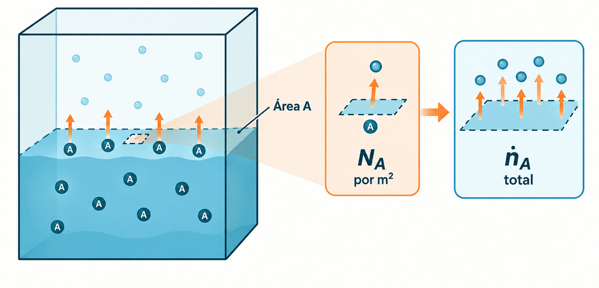

Imagina una sustancia $A$ que pasa de una región de alta concentración a otra de baja concentración.

Por ejemplo, un líquido volátil se evapora hacia una corriente de aire:

$$
\text{Líquido con A}
\quad\longrightarrow\quad
\text{A en el aire}
$$

La pregunta fundamental es:

> **¿Cuánta masa de A atraviesa una determinada área por unidad de tiempo?**

Para responderla utilizamos el **flujo molar**:

$$
\underline{N_A=\frac{\dot n_A}{A}}
$$

donde:

* $N_A$: flujo molar, $\mathrm{mol/(m^2\,s)}$
* $\dot n_A$: velocidad de transferencia, $\mathrm{mol/s}$
* $A$: área de transferencia, $\mathrm{m^2}$

Por tanto:

$$
\underline{\dot n_A=N_AA}
$$

Esta diferencia será muy importante en los ejercicios.

**Flujo $N_A$** = transferencia por unidad de área.

**Velocidad $\dot n_A$** = transferencia total en el equipo.

---

# 2. ¿Por qué ocurre la transferencia?

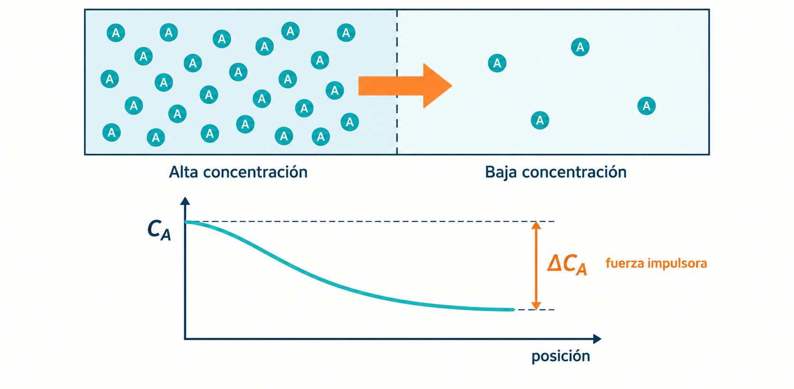

La causa fundamental es una **fuerza impulsora**.

Si tenemos:

$$
C_{A,1}>C_{A,2}
$$

la especie $A$ tiende a desplazarse:

$$
\underline{\text{alta concentración}\rightarrow\text{baja concentración}}
$$

Cuanto mayor sea la diferencia:

$$
\Delta C_A=C_{A,1}-C_{A,2}
$$

mayor será, generalmente, la transferencia.

Esto conduce a una idea central de todo el curso:

$$
\underline{
\text{Velocidad de transferencia}
=
\text{capacidad de transferencia}
\times
\text{fuerza impulsora}
}
$$

En transferencia de masa:

$$
\underline{N_A=k_c\Delta C_A}
$$

---

# 3. Difusión molecular: ley de Fick

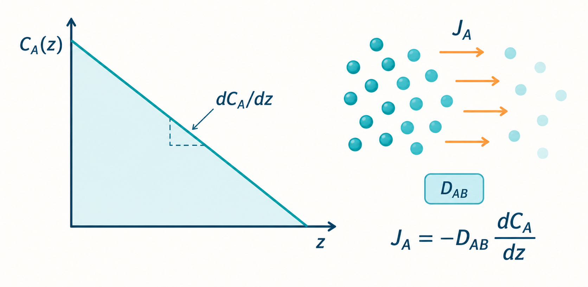

La ecuación fundamental de la difusión es la **primera ley de Fick**:

$$
\underline{
J_A=-D_{AB}\frac{dC_A}{dz}
}
$$

Esta ecuación merece analizarse término por término.

### $J_A$: flujo difusivo

Indica cuántos moles de $A$ atraviesan una unidad de área por unidad de tiempo:

$$
[J_A]=\frac{mol}{m^2s}
$$

### $D_{AB}$: difusividad

Representa la facilidad con la que $A$ se difunde a través de $B$.

Sus unidades son:

$$
[D_{AB}]=m^2/s
$$

Una difusividad grande significa que la especie puede difundirse con mayor facilidad.

### $\frac{dC_A}{dz}$: gradiente de concentración

Indica cómo cambia la concentración con la posición:

$$
\left[\frac{dC_A}{dz}\right]
=
\frac{mol/m^3}{m}
=
mol/m^4
$$

Por tanto:

$$
\frac{m^2}{s}\frac{mol}{m^4}
=
\frac{mol}{m^2s}
$$

que son precisamente las unidades de flujo.

---

# 4. ¿Por qué existe el signo negativo?

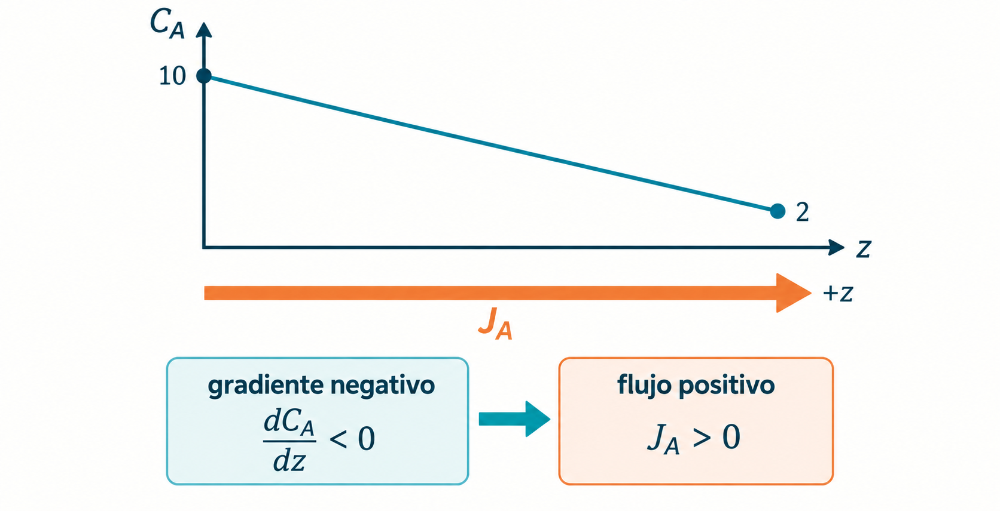

Tenemos:

$$
J_A=-D_{AB}\frac{dC_A}{dz}
$$

El signo negativo representa físicamente que la difusión ocurre **en sentido contrario al aumento de concentración**.

Por ejemplo:

$$
C_{A,1}=10
$$

y más adelante:

$$
C_{A,2}=2
$$

La concentración disminuye al aumentar $z$, por lo que:

$$
\frac{dC_A}{dz}<0
$$

Como:

$$
J_A=-D_{AB}(\text{valor negativo})
$$

entonces:

$$
J_A>0
$$

El flujo ocurre en la dirección positiva de $z$.

---

# 5. Forma integrada de la ley de Fick

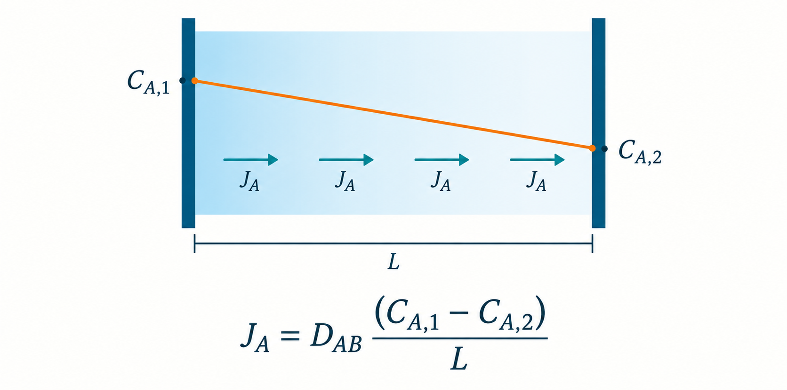

Consideremos una película plana de espesor $L$:

$$
C_{A,1}
\quad|\underbrace{\hspace{3cm}}_{L}|\quad
C_{A,2}
$$

Si suponemos:

* estado estacionario,
* $D_{AB}$ constante,
* geometría plana,
* perfil de concentración lineal,

podemos aproximar:

$$
\frac{dC_A}{dz}
=
\frac{C_{A,2}-C_{A,1}}{L}
$$

Entonces:

$$
J_A
=
-D_{AB}
\frac{C_{A,2}-C_{A,1}}{L}
$$

Reordenando:

$$
\underline{
J_A=
\frac{D_{AB}}{L}
(C_{A,1}-C_{A,2})
}
$$

Observa la estructura:

$$
J_A=
\underbrace{\frac{D_{AB}}{L}}_{\text{capacidad de transferencia}}
\underbrace{(C_{A,1}-C_{A,2})}_{\text{fuerza impulsora}}
$$

Esto nos conduce directamente al concepto de **coeficiente de transferencia de masa**.

---

# 6. Coeficiente de transferencia de masa

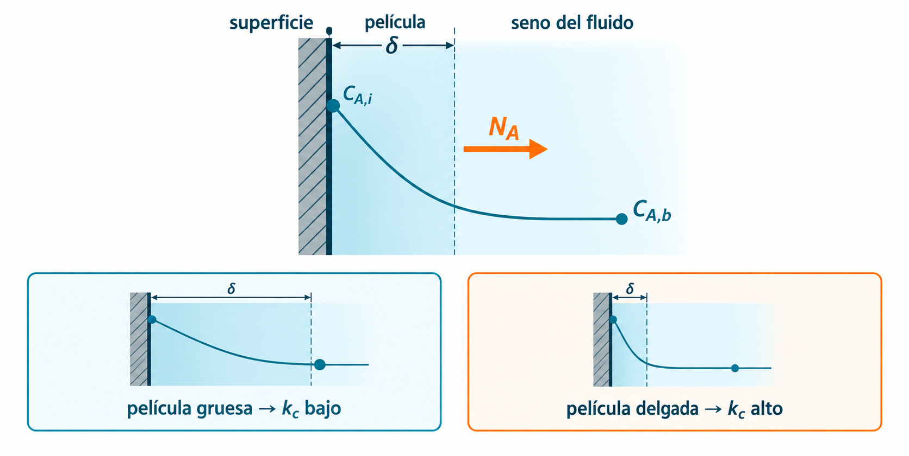

En sistemas reales no siempre conocemos exactamente el espesor de la película ni el perfil de concentración.

Por eso definimos:

$$
\underline{
N_A=k_c(C_{A,i}-C_{A,b})
}
$$

donde:

* $k_c$: coeficiente de transferencia de masa, $\mathrm{m/s}$
* $C_{A,i}$: concentración de $A$ en la interfase
* $C_{A,b}$: concentración de $A$ en el seno del fluido

La diferencia

$$
C_{A,i}-C_{A,b}
$$

es la **fuerza impulsora**.

Una manera simplificada de visualizarlo es:

$$
\underline{
k_c\sim\frac{D_{AB}}{\delta}
}
$$

donde $\delta$ representa un espesor efectivo de película.

Esta relación es conceptualmente muy importante.

Si aumenta $D_{AB}$:

$$
D_{AB}\uparrow
\quad\Rightarrow\quad
k_c\uparrow
$$

Si disminuye el espesor efectivo:

$$
\delta\downarrow
\quad\Rightarrow\quad
k_c\uparrow
$$

Por eso aumentar la agitación o velocidad del fluido generalmente incrementa la transferencia de masa.

---

# 7. Ejercicio 1 — Aplicación directa de Fick

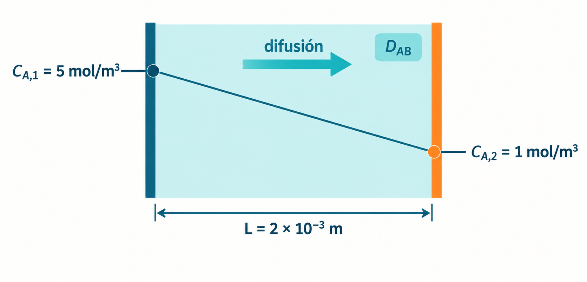

Una sustancia $A$ se difunde a través de una película líquida de espesor:

$$
L=2.0\times10^{-3}\;m
$$

La difusividad es:

$$
D_{AB}=1.5\times10^{-9}\;m^2/s
$$

Las concentraciones en los extremos son:

$$
C_{A,1}=5.0\;mol/m^3
$$

$$
C_{A,2}=1.0\;mol/m^3
$$

Calcular el flujo difusivo.

### Paso 1. Seleccionar la ecuación

Utilizamos:

$$
J_A=
\frac{D_{AB}}{L}
(C_{A,1}-C_{A,2})
$$

### Paso 2. Fuerza impulsora

$$
\Delta C_A=5.0-1.0
$$

$$
\Delta C_A=4.0\;mol/m^3
$$

### Paso 3. Sustituir

$$
J_A=
\frac{1.5\times10^{-9}}
{2.0\times10^{-3}}
(4.0)
$$

Primero:

$$
\frac{1.5\times10^{-9}}
{2.0\times10^{-3}}
=
7.5\times10^{-7}\;m/s
$$

Entonces:

$$
J_A=(7.5\times10^{-7})(4)
$$

$$
\underline{
J_A=3.0\times10^{-6}\;mol/(m^2s)
}
$$

### Interpretación

Cada segundo atraviesan:

$$
3.0\times10^{-6}\;mol
$$

por cada metro cuadrado de superficie.

---

# 8. Ejercicio 2 — Coeficiente de transferencia

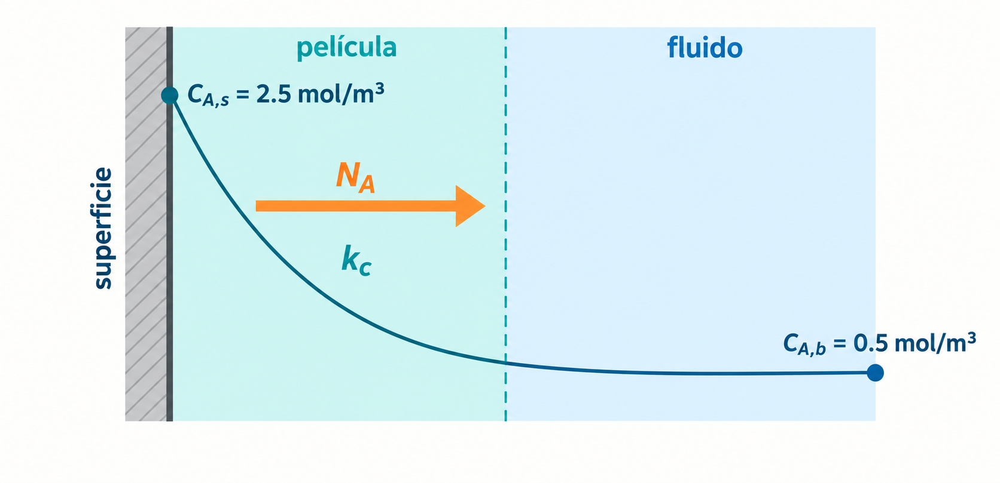

Ahora consideremos un sistema real.

Se tiene:

$$
k_c=4.0\times10^{-4}\;m/s
$$

La concentración de $A$ en la superficie es:

$$
C_{A,s}=2.5\;mol/m^3
$$

y en el seno del líquido:

$$
C_{A,b}=0.5\;mol/m^3
$$

Calcular $N_A$.

### Paso 1. Ecuación

$$
N_A=k_c(C_{A,s}-C_{A,b})
$$

### Paso 2. Fuerza impulsora

$$
\Delta C_A=2.5-0.5
$$

$$
\Delta C_A=2.0\;mol/m^3
$$

### Paso 3. Sustituir

$$
N_A=
(4.0\times10^{-4})(2.0)
$$

Por tanto:

$$
\underline{
N_A=8.0\times10^{-4}\;mol/(m^2s)
}
$$

---

# 9. Ejercicio 3 — Transferencia total

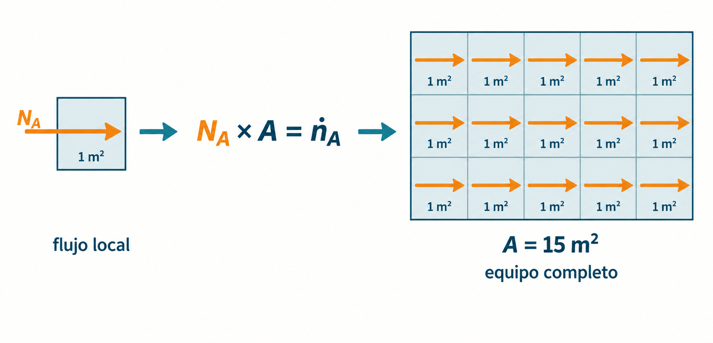

Continuemos con el ejercicio anterior, pero supongamos que el equipo tiene un área de transferencia de:

$$
A=15\;m^2
$$

¿Cuántos moles de $A$ se transfieren por segundo?

Ya conocemos:

$$
N_A=8.0\times10^{-4}\;mol/(m^2s)
$$

Utilizamos:

$$
\dot n_A=N_AA
$$

Sustituyendo:

$$
\dot n_A=
(8.0\times10^{-4})(15)
$$

$$
\underline{
\dot n_A=1.20\times10^{-2}\;mol/s
}
$$

Es decir:

$$
\underline{\dot n_A=0.012\;mol/s}
$$

Si queremos expresarlo por hora:

$$
0.012\frac{mol}{s}
\left(
3600\frac{s}{h}
\right)
$$

$$
\underline{
\dot n_A=43.2\;mol/h
}
$$

Aquí aparece una distinción fundamental:

$$
\underline{
N_A=8.0\times10^{-4}\;mol/(m^2s)
}
$$

es el **flujo**, mientras que:

$$
\underline{
\dot n_A=0.012\;mol/s
}
$$

es la **velocidad total de transferencia**.

---

# 10. Ejercicio 4 — Determinar $k_c$ experimentalmente

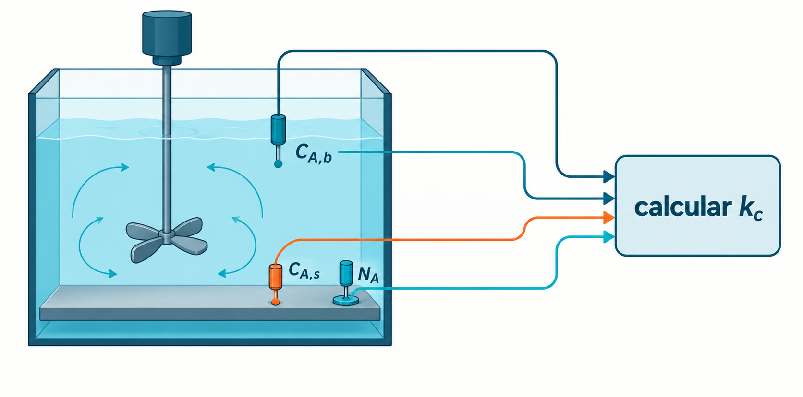

En un experimento se mide un flujo:

$$
N_A=6.0\times10^{-4}\;mol/(m^2s)
$$

Las concentraciones son:

$$
C_{A,s}=3.5\;mol/m^3
$$

$$
C_{A,b}=0.5\;mol/m^3
$$

Determine $k_c$.

Partimos de:

$$
N_A=k_c(C_{A,s}-C_{A,b})
$$

Despejamos:

$$
\underline{
k_c=
\frac{N_A}
{C_{A,s}-C_{A,b}}
}
$$

La diferencia de concentración es:

$$
3.5-0.5=3.0\;mol/m^3
$$

Entonces:

$$
k_c=
\frac{6.0\times10^{-4}}{3.0}
$$

$$
\underline{
k_c=2.0\times10^{-4}\;m/s
}
$$

Este procedimiento es importante porque muchos coeficientes de transferencia de masa se obtienen **experimentalmente**.

---

# 11. Transferencia de masa en gases

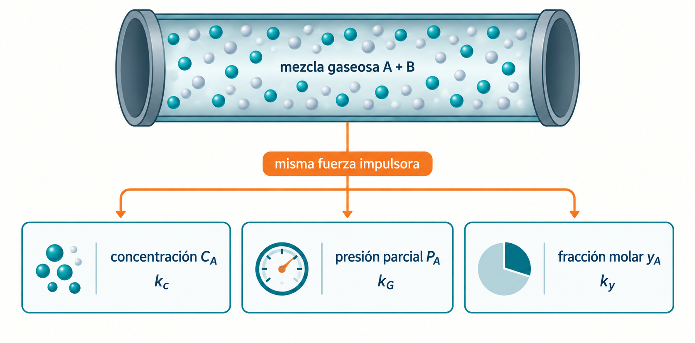

Hasta ahora utilizamos concentración:

$$
N_A=k_c(C_{A,i}-C_{A,b})
$$

En gases también es habitual utilizar **presiones parciales**:

$$
\underline{
N_A=k_G(P_{A,b}-P_{A,i})
}
$$

La idea física no cambia.

Tenemos:

$$
\text{flujo}
=
\text{coeficiente}
\times
\text{fuerza impulsora}
$$

Solo cambia la forma de expresar la fuerza impulsora.

También podemos encontrar ecuaciones basadas en fracciones molares:

$$
\underline{
N_A=k_y(y_{A,b}-y_{A,i})
}
$$

Por tanto, es fundamental revisar **cómo está definido el coeficiente** antes de utilizarlo.

No debemos introducir un $k_G$ basado en presión parcial en una ecuación escrita en términos de concentración sin realizar las conversiones correspondientes.

---

# 12. Transferencia entre un gas y un líquido

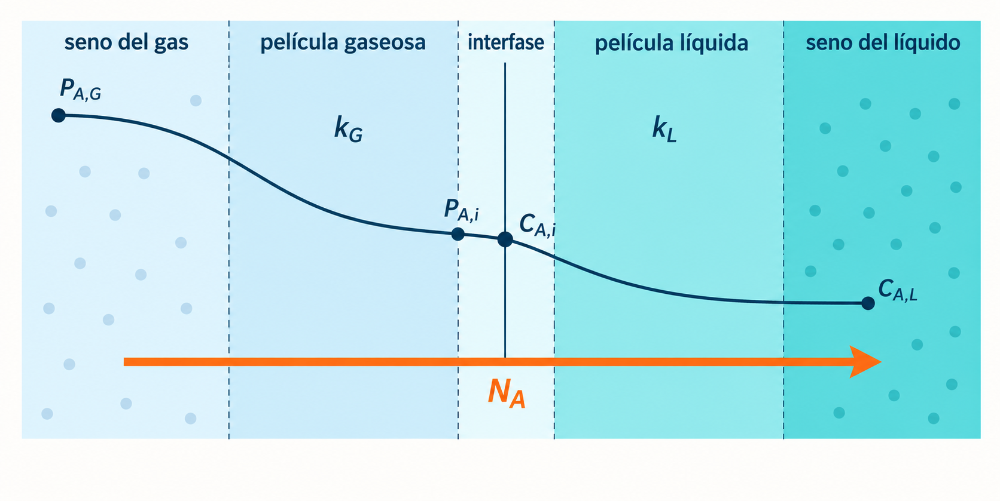
Ahora llegamos al caso más importante para la segunda lección.

Supongamos que $A$ pasa desde un gas hacia un líquido:

$$
\underline{
\text{Gas}
\rightarrow
\text{interfase}
\rightarrow
\text{Líquido}
}
$$

Por ejemplo, absorción de un gas soluble.

Según la teoría de las dos películas:

$$
\text{seno del gas}
\rightarrow
\underline{\text{película gaseosa}}
\rightarrow
\text{interfase}
\rightarrow
\underline{\text{película líquida}}
\rightarrow
\text{seno del líquido}
$$

En la fase gaseosa:

$$
\underline{
N_A=k_G(P_{A,G}-P_{A,i})
}
$$

En la fase líquida:

$$
\underline{
N_A=k_L(C_{A,i}-C_{A,L})
}
$$

En estado estacionario:

$$
\underline{
N_{A,G}=N_{A,L}=N_A
}
$$

Es decir, la misma cantidad que atraviesa la película gaseosa debe atravesar la película líquida.

Aquí surge un problema: necesitamos conocer las condiciones **interfaciales** $P_{A,i}$ y $C_{A,i}$, que normalmente son difíciles de medir.

La solución será combinar las dos resistencias y definir un **coeficiente global de transferencia de masa**:

$$
K_G
\qquad\text{o}\qquad
K_L
$$

Eso será el núcleo de la **Lección 2**.

---

# 13. Problema integrador

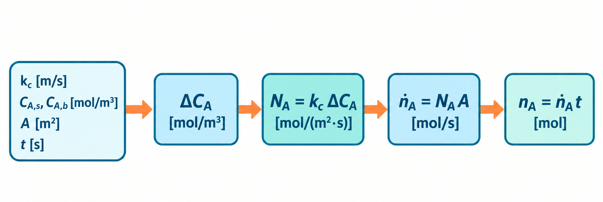

Una especie $A$ se transfiere desde una superficie hacia un líquido. Se conocen:

$$
k_c=3.5\times10^{-4}\;m/s
$$

$$
C_{A,s}=4.2\;mol/m^3
$$

$$
C_{A,b}=1.2\;mol/m^3
$$

El área disponible es:

$$
A=8.0\;m^2
$$

Determina:

**a)** La fuerza impulsora.
**b)** El flujo molar.
**c)** La velocidad molar total.
**d)** Los moles transferidos durante 30 minutos.

### a) Fuerza impulsora

$$
\Delta C_A=C_{A,s}-C_{A,b}
$$

$$
\Delta C_A=4.2-1.2
$$

$$
\underline{
\Delta C_A=3.0\;mol/m^3
}
$$

### b) Flujo

$$
N_A=k_c\Delta C_A
$$

$$
N_A=(3.5\times10^{-4})(3.0)
$$

$$
\underline{
N_A=1.05\times10^{-3}\;mol/(m^2s)
}
$$

### c) Velocidad total

$$
\dot n_A=N_AA
$$

$$
\dot n_A=
(1.05\times10^{-3})(8)
$$

$$
\underline{
\dot n_A=8.4\times10^{-3}\;mol/s
}
$$

### d) Cantidad transferida

Treinta minutos equivalen a:

$$
t=(30)(60)=1800\;s
$$

Entonces:

$$
n_A=\dot n_A t
$$

$$
n_A=(8.4\times10^{-3})(1800)
$$

$$
\underline{
n_A=15.12\;mol
}
$$

Por tanto, durante los 30 minutos se transfieren aproximadamente:

$$
\underline{15.1\;mol}
$$

---

## Ejercicios para practicar

**Ejercicio A.** Se tiene:

$$
D_{AB}=2.0\times10^{-9}\;m^2/s
$$

$$
L=1.0\times10^{-3}\;m
$$

$$
C_{A,1}=6\;mol/m^3
$$

$$
C_{A,2}=2\;mol/m^3
$$

Calcula $J_A$ utilizando la ley de Fick.

**Ejercicio B.** Para:

$$
k_c=5\times10^{-4}\;m/s
$$

$$
C_{A,s}=3.0\;mol/m^3
$$

$$
C_{A,b}=0.8\;mol/m^3
$$

calcula $N_A$.

**Ejercicio C.** Si el sistema del ejercicio B tiene:

$$
A=20\;m^2
$$

determina $\dot n_A$ en $\mathrm{mol/s}$ y $\mathrm{mol/h}$.

**Ejercicio D.** Un experimento proporciona:

$$
N_A=9\times10^{-4}\;mol/(m^2s)
$$

$$
C_{A,s}=5.0\;mol/m^3,\qquad
C_{A,b}=2.0\;mol/m^3
$$

Determina experimentalmente $k_c$.

---

### Resumen

Las cuatro ecuaciones esenciales son:

$$
\underline{J_A=-D_{AB}\frac{dC_A}{dz}}
$$

$$
\underline{
J_A=\frac{D_{AB}}{L}(C_{A,1}-C_{A,2})
}
$$

$$
\underline{
N_A=k_c(C_{A,i}-C_{A,b})
}
$$

$$
\underline{
\dot n_A=N_AA
}
$$

La idea que conecta todas ellas es:

$$
\underline{
\text{Transferencia de masa}
=
\text{capacidad de transporte}
\times
\text{fuerza impulsora}
}
$$
