# Leccion 7. Equilibrio vapor–líquido

## 1. Fundamentos del equilibrio vapor–líquido

### Dos fases de una misma mezcla

Una mezcla puede encontrarse simultáneamente en **fase líquida** y **fase vapor**. En un recipiente cerrado, algunas moléculas del líquido adquieren suficiente energía para pasar al vapor, mientras que otras moléculas presentes en el vapor regresan al líquido.

Estos dos procesos ocurren simultáneamente:

$$
\text{líquido}\rightleftharpoons\text{vapor}
$$

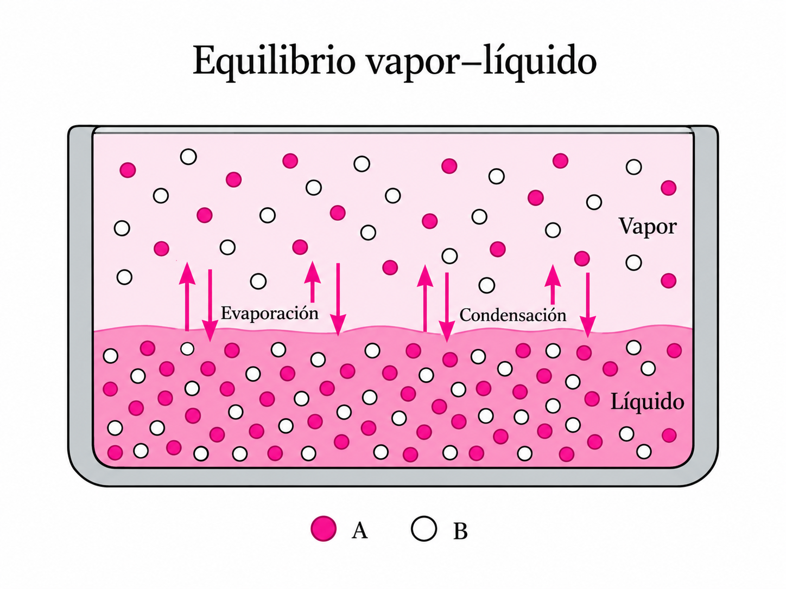

### Equilibrio dinámico

El equilibrio se alcanza cuando la velocidad con la que las moléculas pasan del líquido al vapor es igual a la velocidad con la que regresan del vapor al líquido.

Se denomina **equilibrio dinámico** porque las moléculas continúan intercambiándose entre las fases aunque, macroscópicamente, las propiedades permanezcan constantes.

### Volatilidad

La **volatilidad** expresa la tendencia de una sustancia a pasar a la fase vapor.

En una mezcla binaria, si A es más volátil que B, A tendrá una mayor tendencia a abandonar la fase líquida.

Por ello, normalmente:

$$
y_A>x_A
$$

donde $x_A$ representa la fracción molar de A en el líquido y $y_A$ su fracción molar en el vapor.
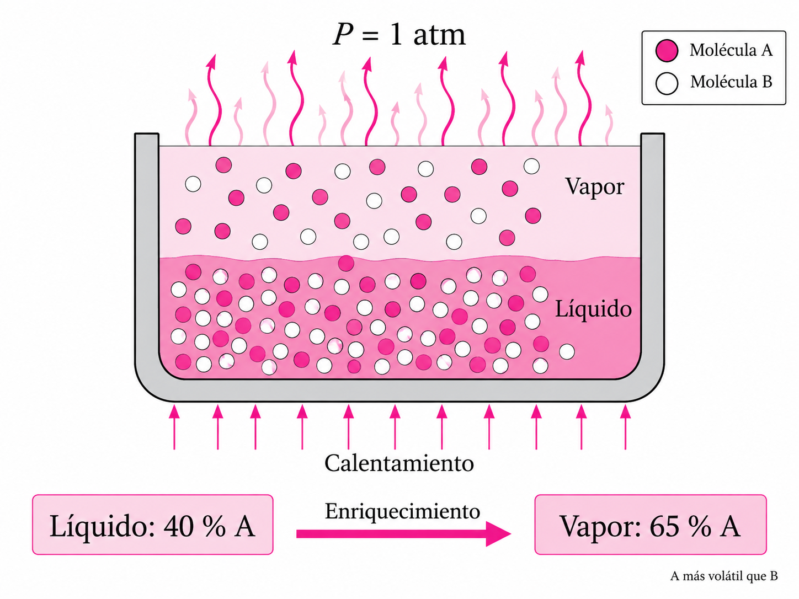

### Enriquecimiento del vapor

Si un líquido presenta:

$$
x_A=0.40
$$

y el vapor en equilibrio presenta:

$$
y_A=0.65
$$

el líquido contiene 40 % molar de A, mientras que el vapor contiene 65 %.

El vapor está, por tanto, **enriquecido en el componente más volátil**.

Esta diferencia de composición entre líquido y vapor constituye la base física de la separación mediante destilación.

---

## 2. Presión de vapor

### Presión de vapor de un líquido puro

En un recipiente cerrado que contiene un líquido puro, algunas moléculas pasan continuamente del líquido al vapor:

$$
L\rightarrow V
$$

mientras otras realizan el proceso contrario:

$$
V\rightarrow L
$$

Cuando las velocidades de ambos procesos se igualan, el vapor ejerce una presión característica denominada **presión de vapor de saturación**:

$$
P_i^{sat}
$$

### Efecto de la temperatura

La presión de vapor depende fuertemente de la temperatura.

Cuando aumenta la temperatura:

$$
T\uparrow\quad\Rightarrow\quad P_i^{sat}\uparrow
$$

Esto significa que aumenta la tendencia de las moléculas a escapar de la fase líquida.

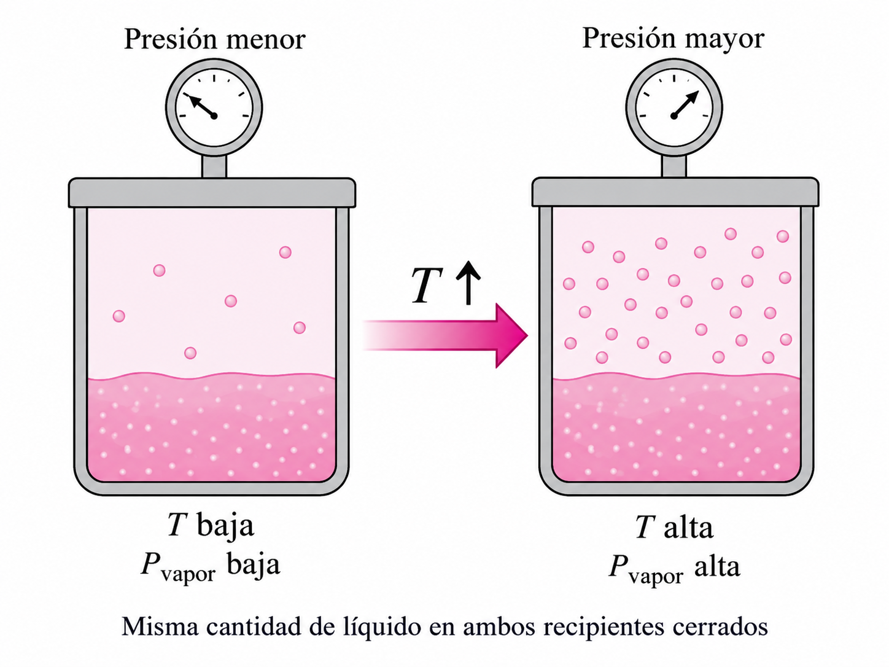

### Presión de vapor y volatilidad

La presión de vapor permite comparar la volatilidad de distintas sustancias a una misma temperatura.

Si:

$$
P_A^{sat}>P_B^{sat}
$$

entonces A es normalmente más volátil que B.

#### Aplicación numérica

A una misma temperatura, supongamos:

$$
P_A^{sat}=90\text{ kPa}
$$

$$
P_B^{sat}=45\text{ kPa}
$$

Como:

$$
90>45
$$

se cumple:

$$
P_A^{sat}>P_B^{sat}
$$

Por tanto, **A es el componente más volátil** bajo esta comparación.

### Condición de ebullición

Un líquido puro alcanza su temperatura de ebullición cuando su presión de vapor iguala la presión externa:

$$
P^{sat}=P
$$

La ebullición puede interpretarse, por tanto, como una condición determinada conjuntamente por temperatura y presión.

---

## 3. Ley de Raoult

### Relación fundamental

Para una solución ideal, la **ley de Raoult** establece:

$$
\underline{P_i=x_iP_i^{sat}}
$$

La presión parcial $P_i$ depende de la fracción molar del componente en el líquido $x_i$ y de su presión de vapor como sustancia pura $P_i^{sat}$.

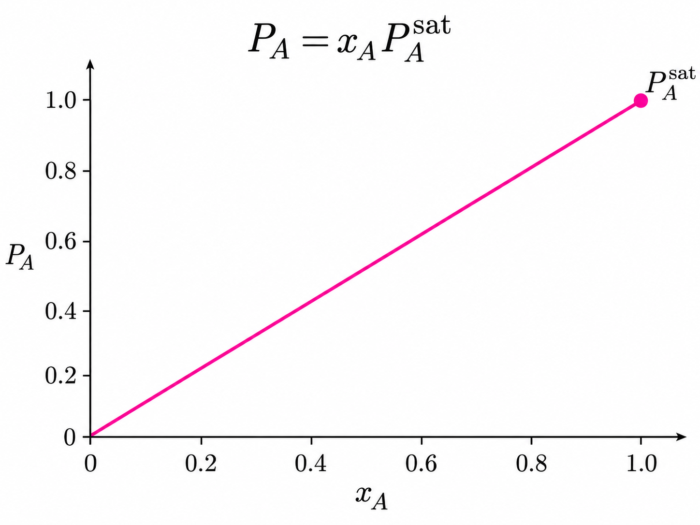

#### Aplicación numérica

Supongamos:

$$
x_A=0.30
$$

$$
P_A^{sat}=80\text{ kPa}
$$

Aplicando la ley de Raoult:

$$
P_A=x_AP_A^{sat}
$$

Sustituyendo:

$$
P_A=(0.30)(80)
$$

$$
\underline{P_A=24\text{ kPa}}
$$

Por tanto, el componente A contribuye con **24 kPa** a la presión.

### Límite de componente puro

Si el líquido está formado completamente por A:

$$
x_A=1
$$

entonces:

$$
P_A=P_A^{sat}
$$

La presión parcial coincide con la presión de vapor del componente puro.

### Efecto de disminuir la composición

Si:

$$
x_A=0.5
$$

la ley de Raoult predice:

$$
P_A=0.5P_A^{sat}
$$

En una solución ideal, reducir la fracción molar del componente reduce proporcionalmente su contribución a la presión.

---

## 4. Ley de Dalton y composición del vapor

### Presión total de una mezcla

La ley de Dalton establece que la presión total es la suma de las presiones parciales:

$$
P=\sum_iP_i
$$

Para una mezcla binaria:

$$
P=P_A+P_B
$$

#### Aplicación numérica

Si:

$$
P_A=35\text{ kPa}
$$

y:

$$
P_B=25\text{ kPa}
$$

entonces:

$$
P=35+25
$$

$$
\underline{P=60\text{ kPa}}
$$

La presión total de la mezcla es **60 kPa**.

### Combinación con la ley de Raoult

Aplicando Raoult a los dos componentes:

$$
P_A=x_AP_A^{sat}
$$

$$
P_B=x_BP_B^{sat}
$$

por lo que:

$$
\underline{P=x_AP_A^{sat}+x_BP_B^{sat}}
$$

con:

$$
x_A+x_B=1
$$

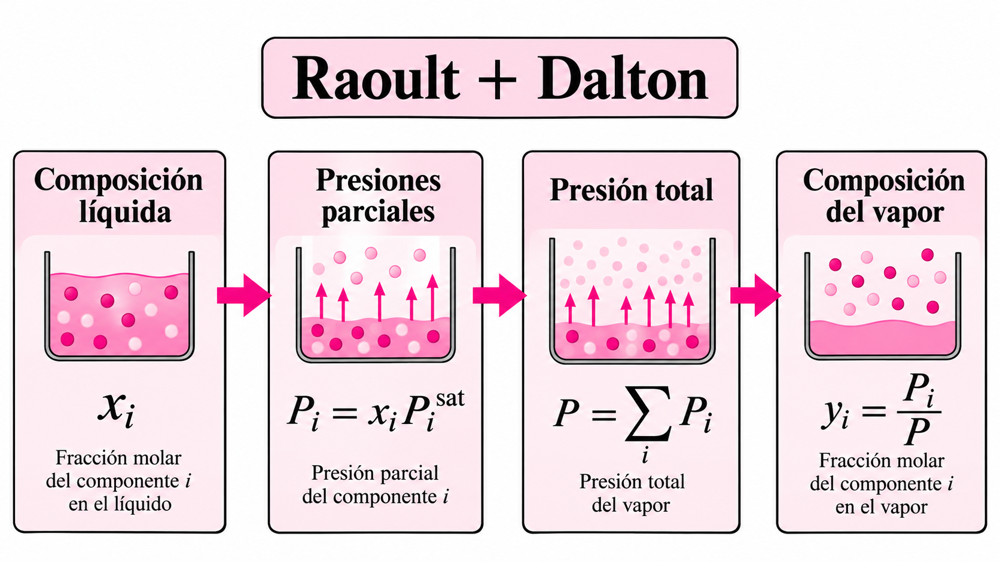

#### Aplicación numérica

Supongamos:

$$
x_A=0.25,\qquad x_B=0.75
$$

y:

$$
P_A^{sat}=120\text{ kPa}
$$

$$
P_B^{sat}=40\text{ kPa}
$$

Entonces:

$$
P=(0.25)(120)+(0.75)(40)
$$

$$
P=30+30
$$

$$
\underline{P=60\text{ kPa}}
$$

Además:

$$
x_A+x_B=0.25+0.75=1
$$

### Composición del vapor

La fracción molar de un componente en el vapor se obtiene mediante:

$$
\underline{y_i=\frac{P_i}{P}}
$$

Combinándola con Raoult:

$$
\underline{y_i=\frac{x_iP_i^{sat}}{P}}
$$

Esta relación conecta directamente las composiciones de las fases líquida y vapor.

#### Aplicación numérica

Si:

$$
x_A=0.20
$$

$$
P_A^{sat}=100\text{ kPa}
$$

y:

$$
P=50\text{ kPa}
$$

entonces:

$$
y_A=\frac{x_AP_A^{sat}}{P}
$$

$$
y_A=\frac{(0.20)(100)}{50}
$$

$$
\underline{y_A=0.40}
$$

El líquido contiene 20 % molar de A, mientras que el vapor contiene **40 % molar de A**.

### Aplicación numérica integrada

Para:

$$
x_A=0.40,\qquad x_B=0.60
$$

y:

$$
P_A^{sat}=100\text{ kPa},\qquad P_B^{sat}=50\text{ kPa}
$$

se obtiene:

$$
P_A=(0.40)(100)=40\text{ kPa}
$$

$$
P_B=(0.60)(50)=30\text{ kPa}
$$

Por Dalton:

$$
P=P_A+P_B
$$

$$
P=40+30=70\text{ kPa}
$$

Por tanto:

$$
y_A=\frac{40}{70}
$$

$$
\underline{y_A=0.571}
$$

El cambio de:

$$
x_A=0.40
$$

a:

$$
y_A=0.571
$$

muestra nuevamente el enriquecimiento del vapor en el componente más volátil.

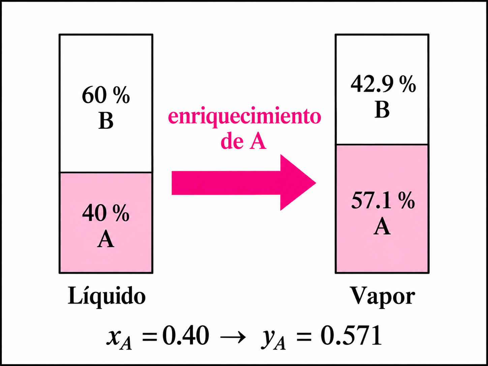

---

## 5. Ley de Henry

### Comportamiento a baja concentración

Cuando un componente se encuentra en cantidades muy pequeñas, su comportamiento puede describirse mediante la **ley de Henry**.

Una forma común es:

$$
\underline{P_i=H_ix_i}
$$

donde $H_i$ es la constante de Henry.

#### Aplicación numérica

Si:

$$
x_i=0.020
$$

y:

$$
H_i=1500\text{ kPa}
$$

entonces:

$$
P_i=H_ix_i
$$

$$
P_i=(1500)(0.020)
$$

$$
\underline{P_i=30\text{ kPa}}
$$

La presión parcial calculada del soluto es **30 kPa**.

### Significado de la constante de Henry

La ecuación indica que, a bajas concentraciones, la presión parcial del soluto es aproximadamente proporcional a su fracción molar en el líquido.

Debe prestarse atención a la definición y las unidades de $H_i$, porque existen diferentes convenciones para expresar esta constante.

#### Aplicación numérica

Si:

$$
P_i=12\text{ kPa}
$$

y:

$$
x_i=0.010
$$

partiendo de:

$$
P_i=H_ix_i
$$

despejamos:

$$
H_i=\frac{P_i}{x_i}
$$

Sustituyendo:

$$
H_i=\frac{12}{0.010}
$$

$$
\underline{H_i=1200\text{ kPa}}
$$

En esta convención, la constante de Henry es **1200 kPa**.

### Raoult frente a Henry

Las dos expresiones presentan una estructura semejante:

$$
\text{Raoult: }P_i=x_iP_i^{sat}
$$

$$
\text{Henry: }P_i=x_iH_i
$$

En el material, Raoult se asocia con el comportamiento de un componente al aproximarse al estado de **componente puro**, mientras Henry resulta especialmente importante para un **soluto muy diluido**.

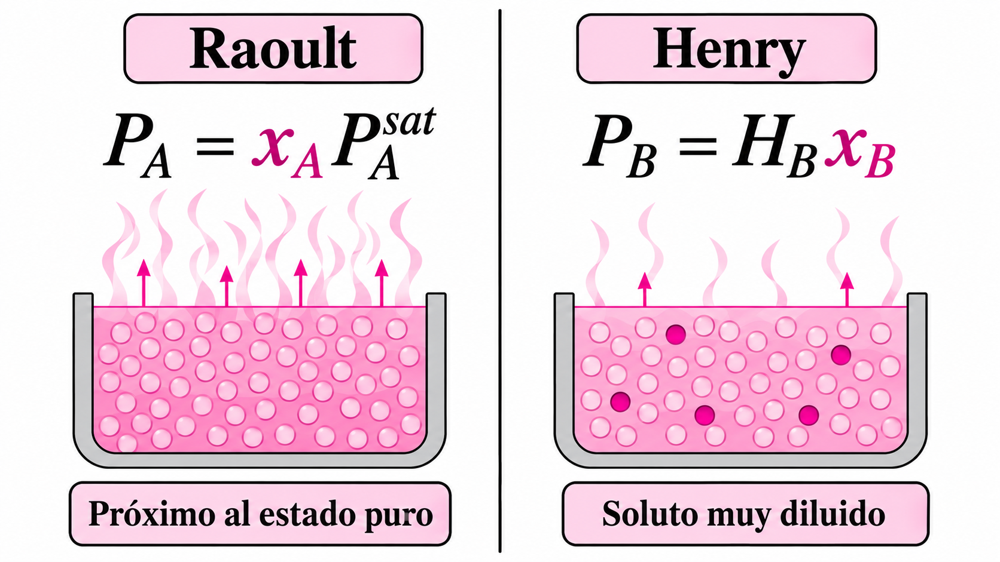

#### Aplicación numérica

Para:

$$
x_i=0.02
$$

supongamos:

$$
P_i^{sat}=80\text{ kPa}
$$

y:

$$
H_i=1200\text{ kPa}
$$

Usando Raoult:

$$
P_i=(0.02)(80)
$$

$$
\underline{P_i=1.6\text{ kPa}}
$$

Usando Henry:

$$
P_i=(0.02)(1200)
$$

$$
\underline{P_i=24\text{ kPa}}
$$

El ejemplo permite observar que ambas relaciones tienen una estructura proporcional, pero utilizan constantes diferentes y corresponden a aproximaciones distintas.

---

## 6. Punto de burbuja y punto de rocío

### Punto de burbuja

El **punto de burbuja** corresponde a la condición en la que un líquido comienza a producir su primera burbuja de vapor:

$$
\text{líquido}\rightarrow\text{líquido + primera burbuja}
$$

El estado inicial es, por tanto, líquido.

### Punto de rocío

El **punto de rocío** corresponde a la condición en la que un vapor comienza a producir su primera gota de líquido:

$$
\text{vapor}\rightarrow\text{vapor + primera gota}
$$

Aquí el estado inicial es vapor.

### Diferencia esencial

Los dos conceptos describen límites opuestos:

* **Punto de burbuja:** se parte de un líquido.
* **Punto de rocío:** se parte de un vapor.

Estos límites permiten posteriormente interpretar las curvas presentes en los diagramas de equilibrio.

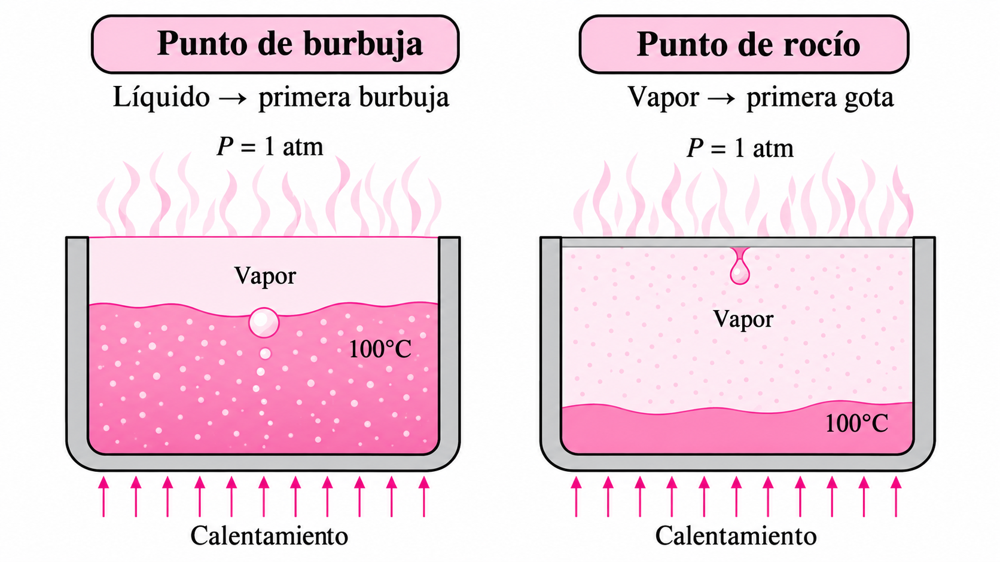

---

## 7. Diagrama T–x–y

### Variables representadas

Un diagrama **T–x–y** representa el equilibrio en función de la temperatura, normalmente a presión constante.

El eje vertical representa la temperatura $T$, mientras el horizontal contiene las composiciones:

$$
0\leq x,y\leq1
$$

  <iframe
    src="https://learncheme.github.io/demos/PxyAndTxyDiagramsForVLE/dist/index.html">
  </iframe>

El diagrama T–x–y se construye para una mezcla binaria específica, es decir, para un par de sustancias, no para cada sustancia individual.

Por ejemplo, para la mezcla etanol–agua a una presión fija existe un diagrama T–x–y. Si se cambia a metanol–agua, se necesita otro diagrama diferente.

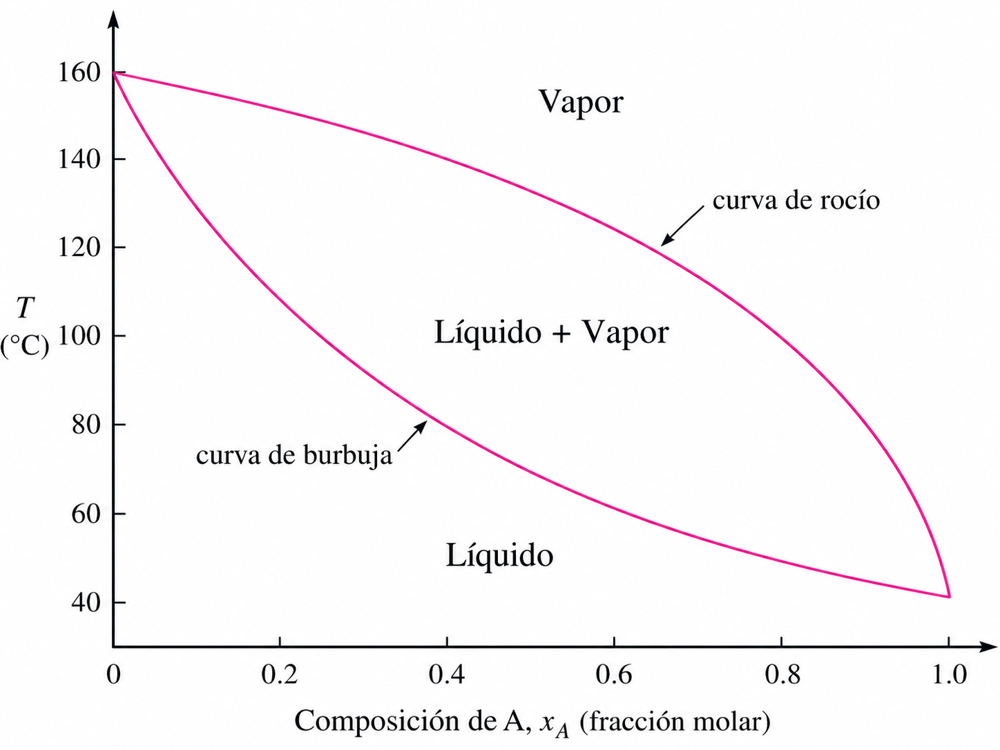

### Curva de burbuja

La **curva de burbuja** representa las temperaturas a las que un líquido de composición $x$ comienza a hervir.

Cada punto de la curva constituye una condición de aparición de la primera burbuja.

### Curva de rocío

La **curva de rocío** representa las temperaturas a las que un vapor de composición $y$ comienza a condensarse.

Cada punto corresponde a la aparición de la primera gota de líquido.

### Regiones de fases

Las curvas dividen el diagrama en tres regiones:

$$
\underline{\text{Líquido}}
$$

$$
\underline{\text{Líquido + Vapor}}
$$

$$
\underline{\text{Vapor}}
$$

A presión constante, típicamente debajo de la curva de burbuja se encuentra la región líquida; entre las curvas coexisten líquido y vapor; por encima de la curva de rocío se encuentra la región vapor.

### Composiciones en equilibrio

Dentro de la región bifásica, una línea horizontal permite relacionar una composición líquida $x$ con una composición de vapor $y$ en equilibrio a la misma temperatura.

---

## 8. Diagrama x–y

### Variables del diagrama

El diagrama **x–y** representa directamente las composiciones de equilibrio.

En el eje horizontal:

$$
x=\text{fracción molar del componente más volátil en el líquido}
$$

En el eje vertical:

$$
y=\text{fracción molar del componente más volátil en el vapor}
$$

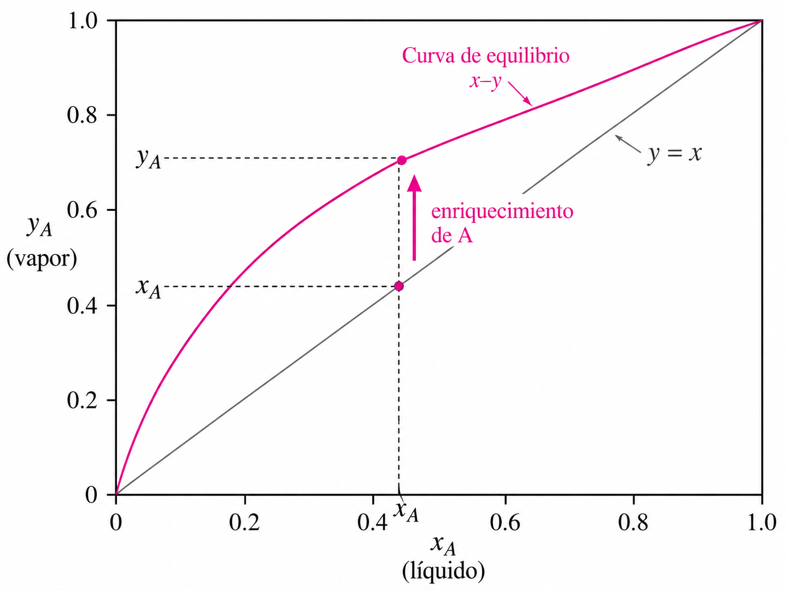

### Diagonal $y=x$

El diagrama incluye la diagonal:

$$
\underline{y=x}
$$

Sobre esta línea, líquido y vapor tendrían exactamente la misma composición.

### Curva de equilibrio

Para una mezcla separable mediante destilación convencional, la curva del componente más volátil suele situarse por encima de la diagonal:

$$
y>x
$$

Esto representa gráficamente el enriquecimiento del vapor.

### Lectura de un punto

Un punto como:

$$
x_A=0.30,\qquad y_A=0.55
$$

indica que un líquido con 30 % molar de A se encuentra en equilibrio con un vapor que contiene 55 % molar de A.

### Conexión con destilación

El diagrama $x-y$ será utilizado posteriormente para construir gráficamente las etapas de una columna de destilación mediante el **método de McCabe–Thiele**.

---

## 9. Volatilidad relativa

**Objetivo de aprendizaje:** comprender cómo la volatilidad relativa expresa la facilidad de separación de dos componentes.

### Definición

Para una mezcla binaria A–B, la **volatilidad relativa** puede definirse como:

$$
\underline{\alpha_{AB}=
\frac{y_A/x_A}{y_B/x_B}}
$$

Esta magnitud compara el comportamiento de los dos componentes entre las fases líquida y vapor.

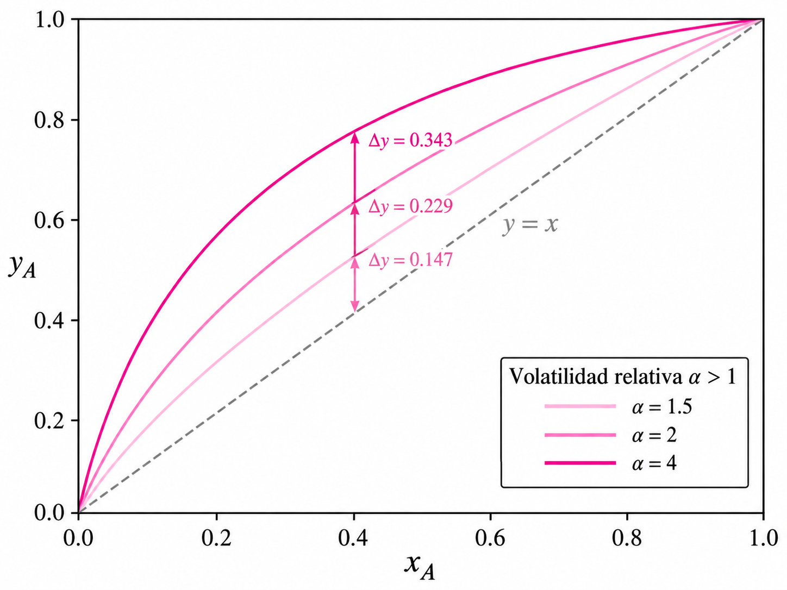

#### Aplicación numérica

Supongamos:

$$
x_A=0.40,\qquad y_A=0.60
$$

Para una mezcla binaria:

$$
x_B=1-x_A=0.60
$$

y:

$$
y_B=1-y_A=0.40
$$

Sustituyendo:

$$
\alpha_{AB}
=
\frac{0.60/0.40}{0.40/0.60}
$$

Calculamos las relaciones:

$$
\frac{0.60}{0.40}=1.5
$$

$$
\frac{0.40}{0.60}=0.667
$$

Entonces:

$$
\alpha_{AB}=\frac{1.5}{0.667}
$$

$$
\underline{\alpha_{AB}\approx2.25}
$$

La volatilidad relativa de A respecto de B es aproximadamente **2.25**.

### Interpretación de $\alpha$

Si A es más volátil que B:

$$
\alpha_{AB}>1
$$

Cuanto más se aleja $\alpha$ de 1, mayor suele ser la diferencia entre las composiciones del líquido y del vapor y más favorable resulta la separación.

Cuando:

$$
\alpha\rightarrow1
$$

las volatilidades se parecen y la separación se vuelve más difícil.

#### Aplicación numérica

Considérense dos casos:

$$
\alpha_1=1.10
$$

y:

$$
\alpha_2=3.0
$$

El primer valor se encuentra próximo a 1, mientras que el segundo presenta una diferencia mayor respecto de 1.

De acuerdo con la interpretación de la volatilidad relativa presentada en esta unidad, el caso con:

$$
\alpha=3.0
$$

representa una mayor diferencia de volatilidades que el caso con:

$$
\alpha=1.10
$$

### Relación con la curva x–y

Si se supone que la volatilidad relativa permanece aproximadamente constante:

$$
\underline{
y=\frac{\alpha x}{1+(\alpha-1)x}
}
$$

Esta expresión permite construir aproximadamente la curva de equilibrio $x-y$.

#### Aplicación numérica

Supongamos:

$$
\alpha=2.0
$$

y:

$$
x=0.30
$$

Sustituyendo:

$$
y=
\frac{(2.0)(0.30)}
{1+(2.0-1)(0.30)}
$$

En el numerador:

$$
(2.0)(0.30)=0.60
$$

En el denominador:

$$
1+(1)(0.30)=1.30
$$

Por tanto:

$$
y=\frac{0.60}{1.30}
$$

$$
\underline{y\approx0.462}
$$

Así:

$$
\underline{x=0.30\rightarrow y\approx0.462}
$$

El vapor en equilibrio contiene aproximadamente **46.2 % molar** del componente más volátil cuando el líquido contiene 30 % molar, bajo este modelo.

### Aplicación

Para:

$$
\alpha=2.5,\qquad x=0.40
$$

se obtiene:

$$
y=
\frac{(2.5)(0.40)}
{1+(2.5-1)(0.40)}
$$

El numerador es:

$$
(2.5)(0.40)=1.00
$$

El denominador es:

$$
1+(1.5)(0.40)
$$

$$
1+0.60=1.60
$$

Por tanto:

$$
y=\frac{1}{1.6}=0.625
$$

Finalmente:

$$
\underline{x=0.40\rightarrow y=0.625}
$$

Una fase líquida con **40 % del componente más volátil** se encuentra en equilibrio, bajo este modelo, con un vapor que contiene aproximadamente **62.5 % de ese componente**.

>## Ejercicios
>
> **1.** En un proceso químico se alimenta a un evaporador una mezcla líquida ideal formada por los componentes A y B. La fracción molar de A en el líquido es de **0.35**. A la temperatura de operación, las presiones de vapor de los componentes puros son $P_A^{sat}=120\ \text{kPa}$ y $P_B^{sat}=50\ \text{kPa}$.
>
>Suponiendo que la mezcla cumple la **ley de Raoult**, determinar las presiones parciales de A y B, la presión total del sistema y las fracciones molares de ambos componentes en el vapor.
>
>---
>
> **2.** Una corriente líquida contiene **25 % molar de A** y **75 % molar de B**. A es el componente más volátil. A cierta temperatura se conocen las siguientes presiones de vapor:
>
>$$
>P_A^{sat}=160\ \text{kPa},\qquad P_B^{sat}=40\ \text{kPa}
>$$
>
>Considerando una solución ideal, calcular la presión total de equilibrio y la composición del vapor producido. Comparar $x_A$ con $y_A$ y explicar si el vapor se encuentra enriquecido en el componente A.
>
>---
>
> **3.** En un proceso de absorción, un gas se encuentra disuelto en un líquido con una fracción molar de **0.012**. A las condiciones de operación, la constante de Henry del gas es:
>
>$$
>H=1800\ \text{kPa}
>$$
>
>Suponiendo que el soluto diluido sigue la **ley de Henry**, determinar su presión parcial en la fase gaseosa. Si la fracción molar del gas disuelto aumentara hasta **0.020** manteniendo la misma temperatura, calcular la nueva presión parcial y explicar cómo cambia. 
>
>---
>
> **4.** Una mezcla líquida binaria se encuentra inicialmente por debajo de su temperatura de ebullición. La mezcla se calienta lentamente a **presión constante** hasta que aparece la primera burbuja de vapor. Se continúa suministrando calor hasta que finalmente queda únicamente vapor.
>
>Explicar qué condición corresponde al **punto de burbuja** y cuál al **punto de rocío**. Realizar además un esquema de un diagrama $T-x-y$ e identificar las regiones de líquido, líquido + vapor y vapor.
>
>---
>
>### 5. Facilidad de separación por destilación
>
>En una columna de destilación se estudia una mezcla binaria formada por A y B. En una etapa de equilibrio se mide una fracción molar de A en el líquido de:
>
>$$
>x_A=0.30
>$$
>
>mientras que el vapor que se encuentra en equilibrio con dicho líquido presenta:
>
>$$
>y_A=0.55
>$$
>
>Calcular $x_B$, $y_B$ y la **volatilidad relativa $\alpha_{AB}$**. A partir del resultado, indicar cuál de los componentes es más volátil y explicar qué significa que la volatilidad relativa sea mayor que 1. 
