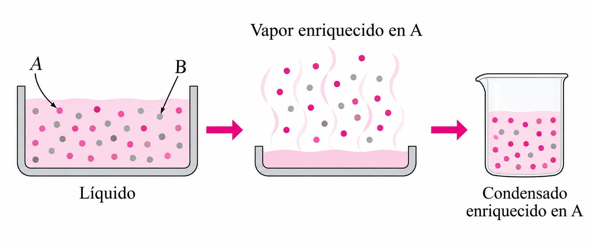
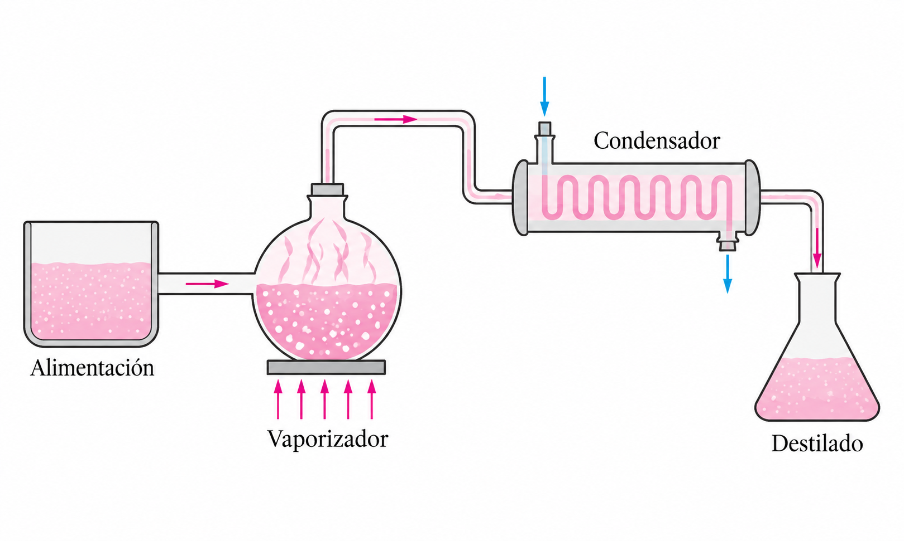
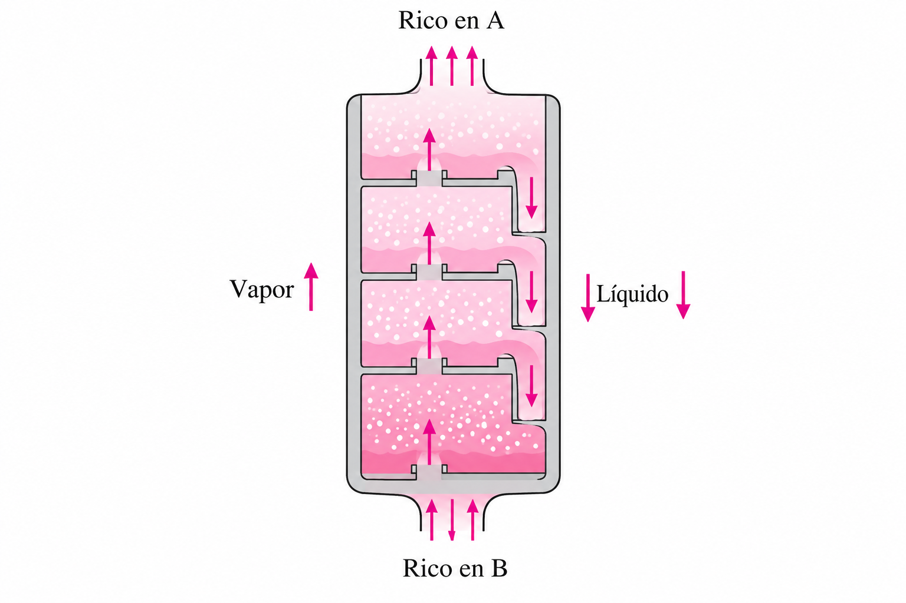
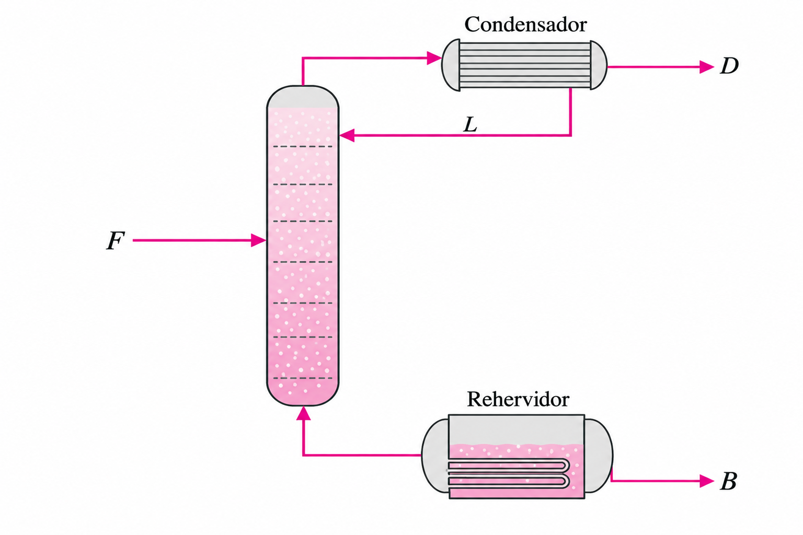
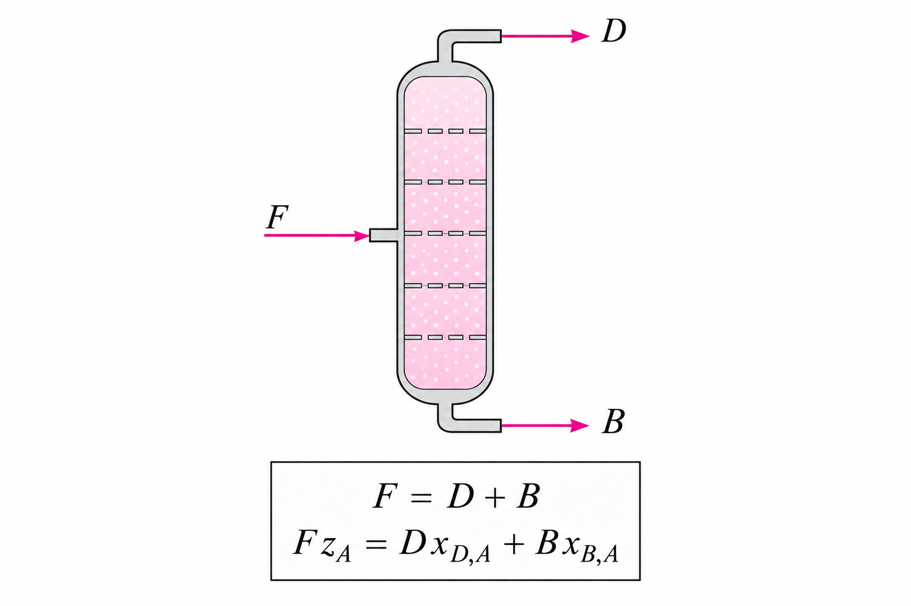
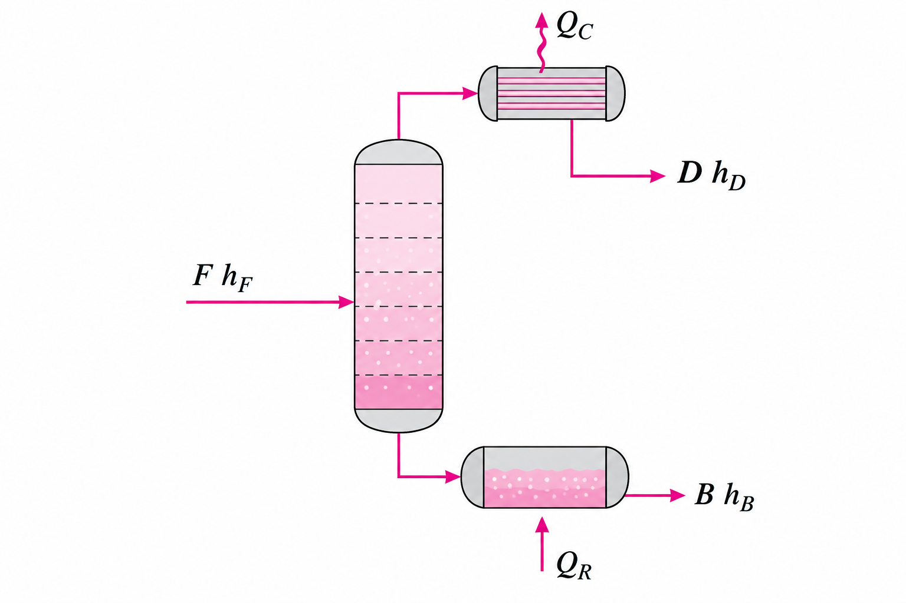
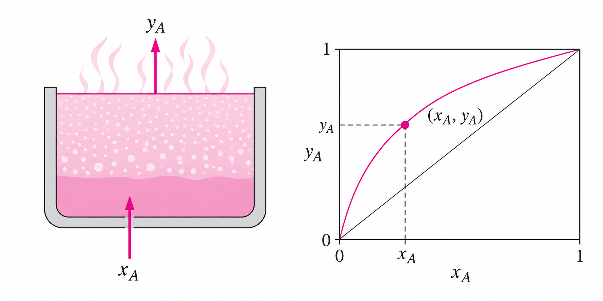
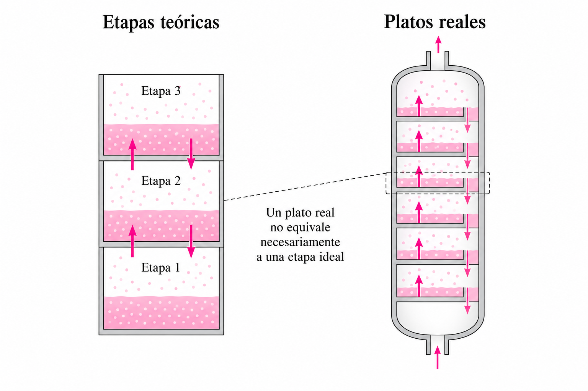
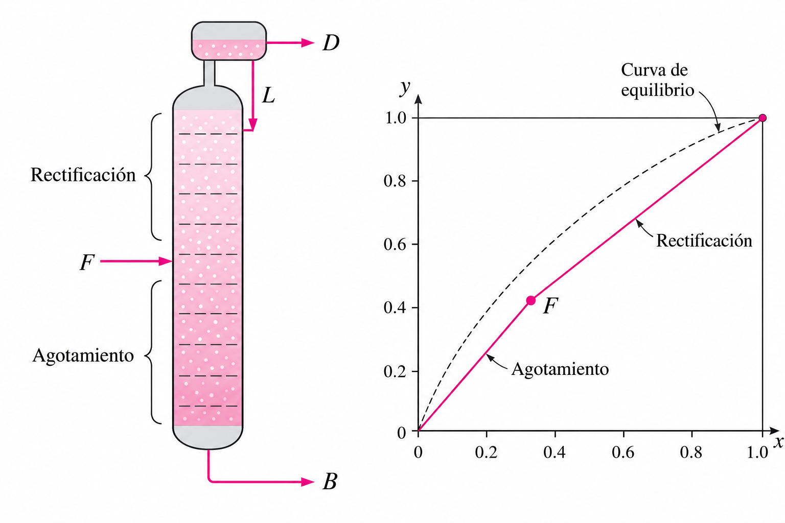

# Lección 8. Fundamentos de destilación

## 1. ¿Qué es la destilación?

### Separación por diferencia de volatilidad

La **destilación** es una operación de separación que aprovecha las diferencias de volatilidad entre los componentes de una mezcla líquida.

Para una mezcla binaria A–B, se considera:

$$
A=\text{componente más volátil}
$$

$$
B=\text{componente menos volátil}
$$

La diferencia de volatilidad hace posible obtener fases con composiciones diferentes.

### Enriquecimiento del vapor

Cuando la mezcla se vaporiza, el vapor suele contener una proporción mayor del componente más volátil:

$$
y_A>x_A
$$

donde $x_A$ representa la fracción molar de A en el líquido y $y_A$ la fracción molar de A en el vapor.

### Vaporización y condensación como mecanismo de separación

Si el vapor enriquecido se separa físicamente del líquido y posteriormente se condensa:

$$
\underline{\text{Líquido}\rightarrow\text{Vapor enriquecido en A}\rightarrow\text{Líquido enriquecido en A}}
$$

se obtiene una corriente líquida con mayor concentración del componente más volátil.

**Aplicación numérica**

Si inicialmente se tienen 100 mol de una mezcla con:

$$
x_A=0.40
$$

y se obtiene un vapor cuya composición es:

$$
y_A=0.65
$$

al condensar completamente ese vapor, el condensado tendrá aproximadamente:

$$
x_A=0.65
$$

Así, la concentración de A pasa de 40 % molar en la mezcla inicial a 65 % molar en el condensado.

### Separaciones sucesivas

Una única vaporización produce cierto enriquecimiento. La destilación industrial amplifica este efecto mediante múltiples procesos sucesivos de vaporización y condensación.

Cada contacto contribuye con una pequeña separación; la acumulación de muchos contactos permite obtener una separación considerable.

---

# 2. Destilación simple

### Secuencia de operación

La destilación simple puede representarse mediante:

$$
\underline{\text{Alimentación}}\rightarrow
\underline{\text{Vaporización}}\rightarrow
\underline{\text{Condensación}}\rightarrow
\underline{\text{Destilado}}
$$

El vapor generado se separa del líquido original y posteriormente se convierte nuevamente en líquido.

### Limitación de la destilación simple

Una sola etapa de vaporización-condensación generalmente no proporciona una separación suficientemente elevada.

Cuando se requiere una pureza mucho mayor, el proceso debe repetirse.

---

# 3. Destilación fraccionada

### Enriquecimientos sucesivos

La destilación fraccionada utiliza múltiples contactos entre líquido y vapor.

Conceptualmente, el enriquecimiento puede representarse como:

$$
0.20\rightarrow0.38\rightarrow0.60\rightarrow0.78\rightarrow\cdots
$$

**Aplicación numérica**

Si una corriente comienza con una fracción molar de A de:

$$
x_A=0.20
$$

y después de varios contactos alcanza:

$$
x_A=0.78
$$

el incremento en la fracción molar es:

$$
\Delta x_A=0.78-0.20=0.58
$$

La concentración de A aumentó en 58 puntos porcentuales de fracción molar.

Cada contacto de equilibrio incrementa progresivamente la concentración del componente más volátil.

### Integración en una columna

En lugar de utilizar numerosos equipos independientes, los contactos líquido-vapor se realizan dentro de una **columna de destilación**.

La columna integra numerosas pequeñas separaciones en un solo equipo.

### Circulación interna

Dentro de la columna ocurren dos movimientos simultáneos:

$$
\underline{\text{Vapor}\uparrow}
$$

$$
\underline{\text{Líquido}\downarrow}
$$

El vapor ascendente se enriquece progresivamente en el componente más volátil, mientras el líquido descendente se enriquece en el menos volátil.

---

# 4. Partes fundamentales de una columna

### Alimentación y productos

Las tres corrientes externas fundamentales son:

$$
F=\text{alimentación}
$$

$$
D=\text{destilado}
$$

$$
B=\text{producto de fondos}
$$

La alimentación entra a la columna y se divide finalmente entre los productos superior e inferior.

**Aplicación numérica**

Por ejemplo, una columna puede recibir:

$$
F=100\text{ kmol/h}
$$

y producir:

$$
D=40\text{ kmol/h}
$$

$$
B=60\text{ kmol/h}
$$

De esta manera, la alimentación queda distribuida entre las dos corrientes de producto.

### Destilado y fondos

El destilado $D$ sale por la parte superior y normalmente está enriquecido en el componente más volátil.

El producto de fondos $B$ sale por la parte inferior y normalmente está enriquecido en el componente menos volátil.

### Condensador

El **condensador** recibe el vapor procedente de la parte superior y elimina energía para convertirlo parcial o totalmente en líquido.

### Rehervidor

El **rehervidor** proporciona energía al líquido situado en la parte inferior para generar vapor que vuelve a entrar en la columna.

---

# 5. Balance global de materia

### Conservación de materia

En estado estacionario, una columna no crea ni destruye materia:

$$
\underline{\text{Entrada}=\text{Salida}}
$$

Para una alimentación y dos productos:

$$
\underline{F=D+B}
$$

Esta expresión constituye el **balance global de materia**.

---

# 6. Balance de componentes

### Composiciones de las corrientes

Para el componente más volátil A:

$$
z_F=\text{fracción molar de A en la alimentación}
$$

$$
x_D=\text{fracción molar de A en el destilado}
$$

$$
x_B=\text{fracción molar de A en los fondos}
$$

Cada caudal debe asociarse con su composición.

### Flujo del componente

La cantidad de A que entra es:

$$
Fz_F
$$

mientras las cantidades que salen son:

$$
Dx_D
\qquad\text{y}\qquad
Bx_B
$$

**Aplicación numérica**

Si:

$$
F=100\text{ kmol/h}
$$

y:

$$
z_F=0.40
$$

la cantidad de A que entra es:

$$
Fz_F=(100)(0.40)
$$

$$
\underline{Fz_F=40\text{ kmol A/h}}
$$

Si el destilado tiene:

$$
D=30\text{ kmol/h},\qquad x_D=0.90
$$

entonces el flujo de A en el destilado es:

$$
Dx_D=(30)(0.90)=27\text{ kmol A/h}
$$

### Balance del componente

Por conservación:

$$
\underline{Fz_F=Dx_D+Bx_B}
$$

Así, los dos balances fundamentales son:

$$
\underline{F=D+B}
$$

$$
\underline{Fz_F=Dx_D+Bx_B}
$$

**Aplicación numérica**

Considérese:

$$
F=100,\qquad z_F=0.40
$$

$$
D=37.5,\qquad x_D=0.90
$$

$$
B=62.5,\qquad x_B=0.10
$$

Entonces:

$$
(100)(0.40)=(37.5)(0.90)+(62.5)(0.10)
$$

$$
40=33.75+6.25
$$

$$
\underline{40=40}
$$

Por tanto, se conserva el componente A.

---

# 7. Resolución conjunta de balances

### Información del sistema

Se dispone de:

$$
F=100\text{ kmol/h}
$$

$$
z_F=0.40,\qquad x_D=0.90,\qquad x_B=0.10
$$

Se buscan $D$ y $B$.

### Balance global

Se plantea:

$$
100=D+B
$$

de donde:

$$
B=100-D
$$

El balance global permite expresar una incógnita en función de la otra.

### Balance de A

Se utiliza:

$$
Fz_F=Dx_D+Bx_B
$$

Sustituyendo:

$$
(100)(0.40)=0.90D+0.10B
$$

Como:

$$
B=100-D
$$

entonces:

$$
40=0.90D+0.10(100-D)
$$

$$
40=0.90D+10-0.10D
$$

$$
30=0.80D
$$

por lo que:

$$
\underline{D=37.5\text{ kmol/h}}
$$

Finalmente:

$$
B=100-37.5
$$

$$
\underline{B=62.5\text{ kmol/h}}
$$

### Comprobación

Los resultados pueden verificarse mediante:

$$
(100)(0.40)=(37.5)(0.90)+(62.5)(0.10)
$$

$$
40=33.75+6.25
$$

$$
\underline{40=40}
$$

La igualdad confirma el cumplimiento del balance del componente A.

---

# 8. Balance de energía

### Necesidad de energía

La destilación implica vaporización y condensación. Por ello, además de materia, debe considerarse la transferencia de energía.

En términos generales:

$$
\underline{\text{Energía que entra}=\text{Energía que sale}}
$$

### Balance energético de la columna

Una forma simplificada es:

$$
Fh_F+Q_R=Dh_D+Bh_B+Q_C
$$

donde $h_F$, $h_D$ y $h_B$ representan las entalpías de las corrientes.

**Aplicación numérica**

Supóngase:

$$
F=100\text{ kmol/h},\qquad h_F=1000\text{ kJ/kmol}
$$

$$
D=40\text{ kmol/h},\qquad h_D=1500\text{ kJ/kmol}
$$

$$
B=60\text{ kmol/h},\qquad h_B=800\text{ kJ/kmol}
$$

y:

$$
Q_C=42\,000\text{ kJ/h}
$$

Sustituyendo:

$$
(100)(1000)+Q_R=(40)(1500)+(60)(800)+42\,000
$$

$$
100\,000+Q_R=60\,000+48\,000+42\,000
$$

$$
100\,000+Q_R=150\,000
$$

por lo tanto:

$$
\underline{Q_R=50\,000\text{ kJ/h}}
$$

El rehervidor debe suministrar 50 000 kJ/h bajo estas condiciones simplificadas.

### Rehervidor y condensador

El rehervidor suministra energía:

$$
Q_R>0
$$

**Aplicación numérica**

Si:

$$
Q_R=50\,000\text{ kJ/h}
$$

entonces:

$$
50\,000>0
$$

lo cual indica que existe un aporte neto de energía hacia el sistema mediante el rehervidor.

El condensador, por su parte, retira energía.

Así, el funcionamiento de una columna combina:

$$
\underline{\text{Equilibrio}}
+
\underline{\text{Balance de materia}}
+
\underline{\text{Balance de energía}}
$$

Esta integración será relevante posteriormente para el método de **Ponchon–Savarit**.

---

# 9. Etapa de equilibrio

### Contacto ideal

Una **etapa de equilibrio** o **etapa teórica** representa un contacto ideal entre líquido y vapor en el cual las corrientes que salen se encuentran en equilibrio termodinámico.

### Composiciones de salida

Si sale un líquido con:

$$
x_A=0.40
$$

y el equilibrio correspondiente establece:

$$
y_A=0.65
$$

entonces:

$$
\underline{x_A=0.40\leftrightarrow y_A=0.65}
$$

Ese par pertenece a la curva de equilibrio $x-y$.

### Sucesión de etapas

Una columna puede representarse como:

$$
\text{Etapa 1}\rightarrow\text{Etapa 2}\rightarrow\text{Etapa 3}\rightarrow\cdots
$$

Cada etapa produce una pequeña separación. Muchas etapas sucesivas permiten obtener una separación global mayor.

---

# 10. Etapa teórica y plato real

### Etapa teórica

Una etapa teórica es un **modelo ideal** en el cual se supone que las corrientes de líquido y vapor alcanzan completamente el equilibrio.

No representa necesariamente una pieza física específica.

### Plato real

Un **plato real** es un dispositivo físico instalado dentro de una columna.

En la práctica, el contacto ocurre durante un tiempo limitado y está condicionado por fenómenos de transferencia de masa, por lo que puede no alcanzarse el equilibrio completo.

### Diferencia entre ambos

Por tanto:

$$
\underline{\text{etapa teórica}\neq\text{plato real}}
$$

Si un cálculo determina:

$$
N_{\text{teóricas}}=10
$$

no implica necesariamente que basten diez platos reales. Puede ocurrir:

$$
N_{\text{real}}>N_{\text{teóricas}}
$$

El número de platos físicos puede ser mayor que el número de etapas ideales calculadas.

La relación se estudiará posteriormente mediante la eficiencia de platos.

---

# 11. Reflujo

### División del condensado

El vapor superior llega al condensador y se transforma en líquido.

Una parte se retira como:

$$
D=\text{destilado}
$$

y otra parte regresa a la columna como:

$$
L=\text{reflujo}
$$

### Función del reflujo

Devolver líquido a la columna mantiene el contacto continuo entre las corrientes líquida y vapor, facilitando la separación.

El reflujo constituye, por tanto, una corriente interna esencial para el funcionamiento de la columna.

### Relación de reflujo

Se define:

$$
\underline{R=\frac{L}{D}}
$$

donde:

* $R$ es la relación de reflujo.
* $L$ es el flujo de líquido que regresa a la columna.
* $D$ es el flujo de destilado retirado.

**Aplicación numérica**

Si:

$$
L=60\text{ kmol/h}
$$

y:

$$
D=30\text{ kmol/h}
$$

entonces:

$$
R=\frac{60}{30}
$$

$$
\underline{R=2}
$$

Por cada mol de destilado retirado se devuelven dos moles de líquido a la columna.

Como comprobación, para 30 kmol/h de destilado:

$$
L=R D=(2)(30)=60\text{ kmol/h}
$$

---

# 12. Efecto del reflujo

### Reflujo y número de etapas

En términos generales, cuando aumenta el reflujo:

$$
R\uparrow
$$

la separación se vuelve más favorable y pueden requerirse menos etapas teóricas:

$$
R\uparrow\quad\Rightarrow\quad N_{\text{etapas}}\downarrow
$$

### Reflujo y energía

Un mayor reflujo también significa una mayor circulación de líquido dentro de la columna.

Ese líquido debe volver a vaporizarse, por lo que:

$$
R\uparrow\quad\Rightarrow\quad\text{consumo energético}\uparrow
$$

### Compromiso de diseño

Aparece entonces una relación fundamental:

$$
\underline{\text{número de etapas}\longleftrightarrow
\text{reflujo}\longleftrightarrow
\text{energía}}
$$

---

# 13. Rectificación y agotamiento

### Alimentación como punto de división

La entrada de alimentación divide conceptualmente la columna en una región superior y una inferior.

Esta división será fundamental para analizar matemáticamente la columna.

### Sección de rectificación

La región situada **por encima de la alimentación** recibe el nombre de sección de **rectificación o enriquecimiento**.

Su función es enriquecer progresivamente el vapor en el componente más volátil:

$$
y_A\uparrow
$$

### Sección de agotamiento

La región situada **por debajo de la alimentación** corresponde a la sección de **agotamiento** o *stripping*.

Su función es retirar del líquido descendente la mayor cantidad posible del componente más volátil, dejando los fondos enriquecidos en el componente menos volátil.

### Dos regiones, dos relaciones

La división tiene una consecuencia importante: cada región tendrá posteriormente su propia **recta de operación**.

La sección superior tendrá una relación líquido-vapor asociada a la rectificación y la inferior otra asociada al agotamiento.

---

# 14. Preparación para McCabe–Thiele

### Información proporcionada por el equilibrio

Del equilibrio vapor–líquido se obtiene una relación:

$$
\underline{y=f(x)}
$$

Esta relación determina qué composición de vapor corresponde a una determinada composición líquida en equilibrio.

**Aplicación numérica**

Supóngase que para una determinada mezcla la relación de equilibrio indica que:

$$
x=0.40
$$

corresponde a:

$$
y=0.65
$$

Entonces:

$$
f(0.40)=0.65
$$

y el punto:

$$
\underline{(x,y)=(0.40,0.65)}
$$

pertenece a la curva de equilibrio.

### Información proporcionada por los balances

Los balances relacionan los caudales:

$$
F,\qquad D,\qquad B
$$

con sus respectivas composiciones.

Permiten establecer cuánto material entra, cuánto sale y cómo se distribuye el componente considerado.

**Aplicación numérica**

Si:

$$
F=100\text{ kmol/h}
$$

y los balances proporcionan:

$$
D=37.5\text{ kmol/h}
$$

$$
B=62.5\text{ kmol/h}
$$

entonces:

$$
F=D+B
$$

$$
100=37.5+62.5
$$

$$
\underline{100=100}
$$

Los balances permiten conocer los caudales que posteriormente se utilizarán para establecer las relaciones de operación de la columna.

### Información proporcionada por las etapas

La columna presenta:

$$
\text{vapor}\uparrow
\qquad
\text{líquido}\downarrow
$$

y puede representarse mediante una sucesión de etapas teóricas.

Cada etapa constituye un contacto líquido-vapor asociado con el equilibrio.

### El problema de diseño

Con estas piezas aparece la pregunta central:

> ¿Cuántas etapas de equilibrio se necesitan para transformar una alimentación de composición $z_F$ en un destilado $x_D$ y unos fondos $x_B$?

Por ejemplo, podrían establecerse las especificaciones:

$$
z_F=0.40
$$

$$
x_D=0.90
$$

$$
x_B=0.10
$$

El problema consiste entonces en determinar cuántas etapas teóricas son necesarias para realizar esta separación bajo unas condiciones de operación determinadas.

El método de **McCabe–Thiele** resolverá gráficamente esta cuestión utilizando el diagrama $x-y$.

### Elementos de McCabe–Thiele

La construcción combinará:

$$
\underline{\text{Curva de equilibrio}}
$$

con:

$$
\underline{\text{Rectas de operación}}
$$

para posteriormente construir gráficamente las etapas entre ambas.

**Aplicación numérica**

Si para una determinada composición líquida:

$$
x=0.40
$$

la curva de equilibrio proporciona:

$$
y^*=0.65
$$

mientras una recta de operación proporciona:

$$
y=0.50
$$

los valores:

$$
(x,y^*)=(0.40,0.65)
$$

y:

$$
(x,y)=(0.40,0.50)
$$

representan dos relaciones diferentes: una corresponde al **equilibrio termodinámico** y la otra a la **operación de la columna**.

La construcción sucesiva entre ambas relaciones permitirá representar las etapas teóricas mediante McCabe–Thiele.

> ## Ejercicio
> 
> Una corriente de alimentación formada por una mezcla binaria de metanol y agua entra a un separador flash que opera en condiciones de equilibrio líquido-vapor.
> 
> La alimentación tiene un flujo molar de
> 
> $$
> F=150\ \text{mol/s} 
> $$
> 
> y una fracción molar de metanol de
> 
> $$ 
> z_m=0.40.
> $$
> 
> Después de alcanzar el equilibrio en el separador, se obtienen una corriente de vapor $V$ y una corriente de líquido $L$. Se sabe que la relación entre los flujos de salida es
> 
> $$ 
> \frac{L}{V}=1.5.
> $$
> 
> Para simplificar el comportamiento de equilibrio de la mezcla, se supone que la volatilidad relativa del metanol respecto al agua es constante y tiene un valor de
> 
> $$
> \alpha=3.3.
> $$
> 
> La relación de equilibrio líquido-vapor para una mezcla binaria con volatilidad relativa constante está dada por:
> 
> $$
> y_m=\frac{\alpha x_m}{1+(\alpha-1)x_m}
> $$
> 
> donde $x_m$ es la fracción molar de metanol en la fase líquida y $y_m$ es la fracción molar de metanol en la fase vapor.
> 
> Se pide
> 1. Determinar los flujos molares de líquido $L$ y vapor $V$ que salen del separador.
> 2. Realizar un balance de metanol y obtener la ecuación de la línea de operación en función de $x_m$ y $y_m$.
> 3. Determinar la pendiente de la línea de operación y relacionarla con la razón $L/V$.
> 4. Utilizando $\alpha=3.3$, obtener la ecuación que describe el equilibrio líquido-vapor de la mezcla.
> 5. Determinar analíticamente la fracción molar de metanol en la corriente líquida, $x_m$, y en la corriente de vapor, $y_m$, mediante la intersección de la línea de operación con la relación de equilibrio.
> 6. Comprobar los resultados mediante el balance global de metanol.
> 7. Representar en un diagrama $y_m$ vs. $x_m$ la curva de equilibrio, la diagonal $y_m=x_m$ y la línea de operación, identificando gráficamente el punto correspondiente a las composiciones de equilibrio del líquido y del vapor.